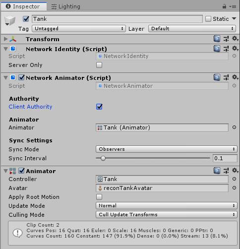

# Network Animator

The Network Animator component allows you to synchronize animation states for networked objects. It synchronizes state and parameters from an Animator Controller.

Note that if you create a Network Animator component on an empty game object, Mirror also creates a Network Identity component and an Animator component on that game object.

-   **Client Authority**  
    Enable this to have changes to animation parameters sent from client to server.

-   **Animator**  
    Use this field to define the Animator component you want the Network Animator to synchronize with.

Normally, changes are sent to all observers of the object this component is on.  Setting **Sync Mode** to Owner Only makes the changes private between the server and the client owner of the object.

You can use the **Sync Interval** to specify how often it syncs (in seconds).

## Details

The Network Animator ensures the synchronization of game object animation across the network, meaning that all players see the animation happen at the same. There are two kinds of authority for networked animation (see documentation on [network authority](../Guides/Authority.md)):

>   **NOTE:** Animator Triggers are not synced directly. Call `NetworkAnimator.SetTrigger` instead. A game object with authority can use the SetTrigger function to fire an animation trigger on other clients.

-   If the game object has authority on the client, you should animate it locally on the client that owns the game object. That client sends the animation state information to the server, which broadcasts it to all the other clients. For example, this may be suitable for player characters with client authority.
-   If the game object has authority on the server, then you should animate it on the server. The server then sends state information to all clients. This is common for animated game objects that are not related to a specific client, such as scene objects and non-player characters, or server-authoritative clients.
