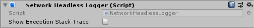

# Network Headless Logger

Network Headless Logger replaces the the default log handler with one that set `Console.ForegroundColor`. 

Only replaces the handler when running in headless mode.

`showExceptionStackTrace` will log the stack trace of any exceptions sent to the handler.