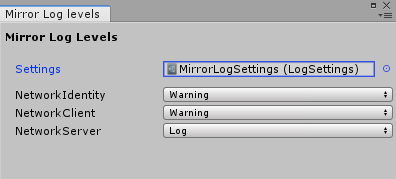

# Network Log Settings

**See also <xref:Mirror.LogFactory> in the API Reference.**

## Network Log Settings component

The Network Log Settings component allows you to configure logging levels and load the settings in a build.

When you first add NetworkLogSettings you will have to Create a new LogSettings asset that will store the settings.

>   **Note:** If a LogSettings asset already exists the NetworkLogSettings component will set the Settings field when it is added to a game object.

## Log Settings 

When you first set up LogSettings the list of components may be empty or incomplete. Running the game will cause Mirror scripts to add their respective loggers to the list so their logging levels can be changed.

Log settings can also be changed using the "Mirror Log Level" window, which can be opened from the editor menu: Window > Analysis > Mirror Log Levels.

To change settings at runtime please see <xref:Mirror.LogFactory>.

## Issues

Mirrors Logging api is currently work in progress. If there is a bug or a feature you want added please make an issue [here](https://github.com/vis2k/Mirror/issues).
