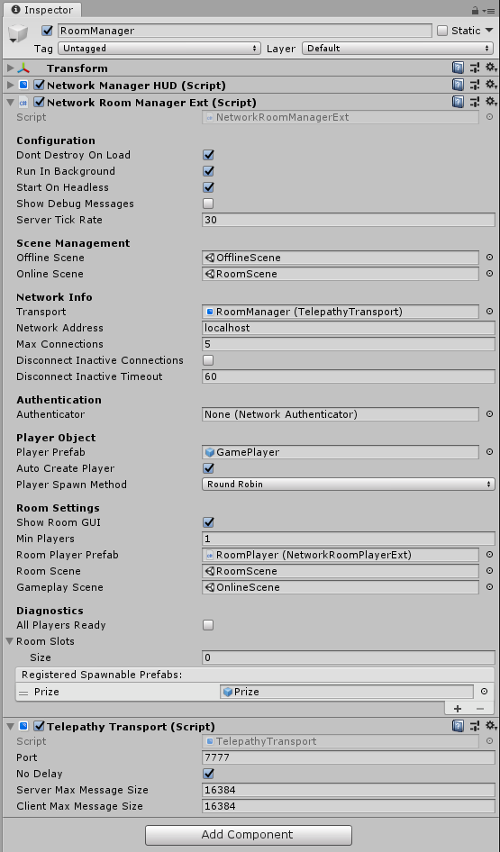

# Network Room Manager

\*\*Please see the Room example in the Examples folder in your Mirror folder

The Network Room Manager is a specialized type of [Network Manager](NetworkManager.md) that provides a multiplayer room before entering the main play scene of the game. It allows you to set up a network with:
-   A maximum player limit
-   Automatic start when all players are ready
-   Option to prevent players from joining a game in progress
-   Customizable ways for players to choose options while in room  

There are two types of player objects with the Network Room Manager:

**Room Player Prefab**
-   One for each player
-   Created when client connects, or player is added
-   Persists until client disconnects
-   Holds ready flag and configuration data
-   Handles commands in the room
-   Must use the [Network Room Player](NetworkRoomPlayer.md) component

**Player Prefab**
-   One for each player
-   Created when game scene is started
-   Destroyed when leaving game scene
-   Handles commands in the game  



## Properties
-   **Show Room GUI**  
    Show the default OnGUI controls for the room.
-   **Min Players**  
    Minimum number of players needed to start a game.
-   **Room Player Prefab**  
    The prefab to create for players when they enter the room (requires Network Room Player component).
-   **Room Scene**  
    The scene to use for the room.
-   **Gameplay Scene**  
    The scene to use for main game play.
-   **pendingPlayers**  
    List\<PendingPlayer\> that holds players that are ready to start playing.
-   **roomSlots**  
    List\<NetworkRoomPlayer\> that manages the slots for connected clients in the room.
-   **allPlayersReady**  
    Bool indicating if all players are ready to start playing.  This value changes as players invoke `CmdChangeReadyState` indicating true or false, and will be set false when a new client connects.

## Methods

### Server Virtual Methods

```cs
public virtual void OnRoomStartHost() {}

public virtual void OnRoomStopHost() {}

public virtual void OnRoomStartServer() {}

public virtual void OnRoomServerConnect(NetworkConnection conn) {}

public virtual void OnRoomServerDisconnect(NetworkConnection conn) {}

public virtual void OnRoomServerSceneChanged(string sceneName) {}

public virtual GameObject OnRoomServerCreateRoomPlayer(NetworkConnection conn)
{
    return null;
}

public virtual GameObject OnRoomServerCreateGamePlayer(NetworkConnection conn)
{
    return null;
}

public virtual bool OnRoomServerSceneLoadedForPlayer(GameObject roomPlayer, GameObject gamePlayer)
{
    return true;
}

public virtual void OnRoomServerPlayersReady()
{
    ServerChangeScene(GameplayScene);
}
```

### Client Virtual Methods

```cs
public virtual void OnRoomClientEnter() {}

public virtual void OnRoomClientExit() {}

public virtual void OnRoomClientConnect(NetworkConnection conn) {}

public virtual void OnRoomClientDisconnect(NetworkConnection conn) {}

public virtual void OnRoomStartClient() {}

public virtual void OnRoomStopClient() {}

public virtual void OnRoomClientSceneChanged(NetworkConnection conn) {}

public virtual void OnRoomClientAddPlayerFailed() {}
```
