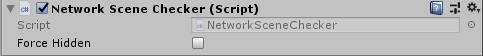

# Network Scene Checker

The Network Scene Checker component controls the visibility of game objects for network clients, based on which scene they're in.



-   **Force Hidden**  
    Tick this checkbox to hide this object from all players.

With the Network Scene Checker, a game running on a client doesn’t have information about game objects that are not visible. This has two main benefits: it reduces the amount of data sent across the network, and it makes your game more secure against hacking.

This component would typically be used when the server has several subscenes loaded and needs to isolate networked objects to the subscene they're in.

A game object with a Network Scene Checker component must also have a Network Identity component. When you create a Network Scene Checker component on a game object, Mirror also creates a Network Identity component on that game object if it does not already have one.

Scene objects with a Network Scene Checker component are disabled when they're not in the same scene, and spawned objects are destroyed when they're not in the same scene.

## Use with Additive Scenes

In Mirror, the Server and connected Clients are always on the same main scene, however the server and clients can have various combinations of smaller subscenes loaded additively. The server may load all subscenes at start, or it may dynamically load and unload subscenes where players or other activity is going on as needed.

All player objects are always first spawned in the main scene, which may or may not have visual content, networked objects, etc. With this component attached to all networked objects, whenever the player object is moved to a subscene (from the main or from another subscene), the observers lists for objects in both the new scene and the prior scene are updated accordingly.

Loading the subscene(s) on the server is through the normal process with `SceneManager`:

```cs
SceneManager.LoadSceneAsync(subScene, LoadSceneMode.Additive);
```

Next, you will send a `SceneMessage` to the client telling it to load a subscene additively:

```cs
SceneMessage msg = new SceneMessage
{
    sceneName = subScene,
    sceneOperation = SceneOperation.LoadAdditive
};

connectionToClient.Send(msg);
```

Then, on the server only, you just move the player object to the subscene:

```cs
// Position the player object in world space first
// This assumes it has a NetworkTransform component that will update clients
player.transform.position = new Vector3(100, 1, 100);

// Then move the player object to the subscene
SceneManager.MoveGameObjectToScene(player, subScene);
```

Optionally you can send another `SceneMessage` to the client with `SceneOperation.UnloadAdditive` to remove any previous additive scene the client no longer needs.  This would apply to a game that has levels after a level change. A short delay may be necessary before removal to allow the client to get fully synced.

Depending on the complexity of your game, you may find it helpful when switching a player between subscenes to move the player object to the main scene first, yield 100 ms, re-position it, and finally move it to the new subscene.
