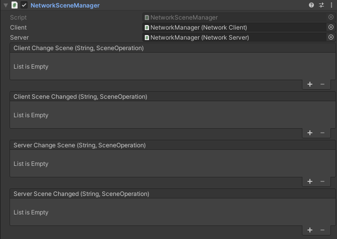

# Network Scene Manager

The Network Scene Manager component controls the Unity Scenes running over the network.



-   **Client Change Scene**  
    Event that fires before the client changes scenes.
-   **Client Changed Scene**  
    Event that fires after the client changes scenes.
-   **Server Change Scene**  
    Event that fires before the server changes scenes.
-   **Server Changed Scene**  
    Event that fires after the server changes scenes.

The Network Scene Maanger allows the user to change network scenes during runtime. There are three types of scene changes broadly supported by MirrorNG: Normal, Additive Load, and Additive Unload.

Normal: In a Normal scene change all currently loaded assets are unspawned and unloaded. The new scene is loaded and set active. Then all of the scene or instance netwrok objects can be spawned. Under this operation the client waits for the server to finish before spawning starts to prevent any race conditions.

Additive Load: The specified scene will be loaded on the Server and Client in addition to the currently active network scene.

Additive Unload: Unload a previously loaded additive scene from the Server and Client.

## How does it work

When the NetworkServer starts it assumes the initial scene is the one you plan on running the network on. If this is not correct you can either change scenes before starting the network or after. The order on the server will likely only matter to you if you are running in Host mode.

Once a NetworkClient connects and passes authentication the NetworkServer will send a message notifying them of the current active scene and any additive scenes they should load. Once that task is complete then the server will start spawning network objects on the NetworkClient.

## How do I change scenes

If the scene change involves network objects then it is strongly reccomended to make any scene changes via the NetworkSceneManager. Doing so via Unity's SceneManager directly may function but give undesired results with network objects.

To do a network scene change you initiate the process via the server NetworkSceneManager via:

```cs
sceneManager.ChangeServerScene("Assets/Mirror/Tests/Runtime/testScene.unity");
```

Note: You dont have to provide the full scene path when initiating a scene change. But the 'NetworkSceneName' will be saved as the full path.