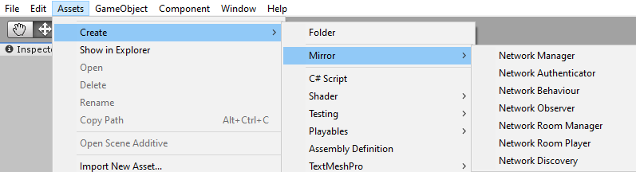

# Script Templates

We've added Script Templates to make it easier to create derived class scripts that inherit from our base classes.

-   All possible overrides are already made for you and organized.
-   They're all fully commented as to what they all do.
-   Base method calls are all in place where needed so you can see what they already do.
-   Each has links at the top to their doc page(s).

Import [this package](ScriptTemplates.unitypackage) to add Script Templates to your project.

> **Restart Required:** You must restart Unity after importing this package!

> **Root Folder Required:** ScriptTemplates is a special folder to Unity and must remain in the Assets root...don't move it.

> **Mirror Version Compatibility:** This package is made for the current Asset Store release of Mirror. It may not be compatible with older versions of Mirror.

After importing and restarting Unity, the Mirror section will appear under the Assets > Create menu, as well as the context menu that comes up when you right-click on any folder in your project.  You'll be prompted for the file name like any other asset creation.

Hopefully these templates will be helpful to new users of Mirror to learn what methods are available in various classes, as well as just being more convenient for everyone.

