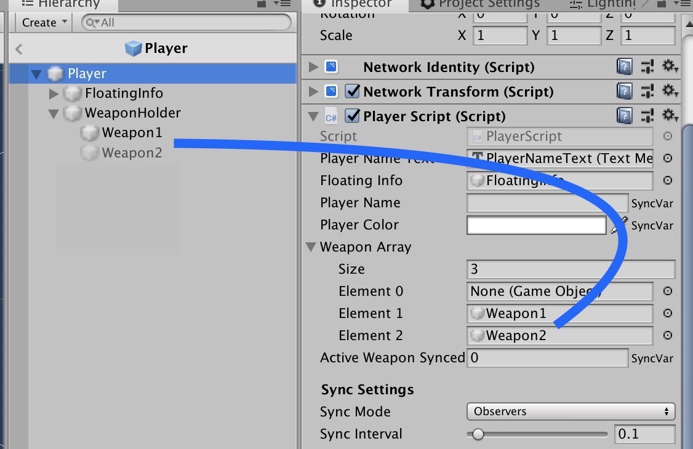

# MirrorNG Quick Start Guide 
This guide currently shows you:
- [Basic scene setup](#part-1)
- [Player movement](#part-4)
- [Names and colours](#part-8)
- [Scene script with canvas buttons](#part-11)
- [Weapon switching](#part-12)

It is best to first make a mini practice game before converting your single player game, or creating your ideal brand new multiplayer.

The Pre-made MirrorNG examples are great for using as reference, it is recommend to use them regarding connection setup, with ports and firewalls. This can be a huge topic that changes from person to person, and is not covered in this guide, here we will use localHost (multiple games on same PC).


## Part 1

Blank Project, import UniTask and MirrorNG using Unity package manager.


## Part 2

- Create new scene, save it, and add it to build settings
- Create a new GameObject, name it NetworkManager in the scene, and add these 3 components
    - NetworkManager
    - KcpTransport
    - NetworkManagerHUD
- On the NetworkManager component, drag your Offline and Online scene into the slots, we have only one scene
for now, so put your scene in both
    - The scene must be in the build settings before dragging it to the field


## Part 3

Setup the scene
- Add a simple Plane floor with: 
    - positions (0, -1, 0)
    - scale (2, 2, 2)
- (optional) add a material to this, I added one called dirt that is used one of mirrors examples
- Next we add a GameObject, name does not matter
- Add `NetworkStartPosition` component to this GameObject
- Duplicate the GameObject a few times, and scatter around your scene floor so that you have multiple spawn points. I did 4, one near each corner


## Part 4

Creating the player
- Create a capsule using the menus as shown in the image
- Attached a NetworkTransform component, this will auto add a Network Identity
- Tick Client Authority on the NetworkTransform


- Rename that object Player
- Add an empty PlayerScript
- Drag into Project to create a prefab
- Then delete Player from scene


- Drag your player prefab into Network manager,
- Set spawn method to Round Robin.


## Part 5

Add the following to your PlayerScript.
```cs
using MirrorNG;
using UnityEngine;

namespace QuickStart
{
    public class PlayerScript : NetworkBehaviour
    {
        public override void OnStartLocalPlayer()
        {
            Camera.main.transform.SetParent(transform);
            Camera.main.transform.localPosition = new Vector3(0, 0, 0);
        }

        void Update()
        {
            if (!isLocalPlayer) { return; }

            float moveX = Input.GetAxis("Horizontal") * Time.deltaTime * 110.0f;
            float moveZ = Input.GetAxis("Vertical") * Time.deltaTime * 4f;

            transform.Rotate(0, moveX, 0);
            transform.Translate(0, 0, moveZ);
        }
    }
}
```


## Part 6

Press play in Unity editor, and then Host (server + client) button in the game window. You should be able to move around with a first person view capsule.


## Part 7

Build and run your scene, open it, host on one, and press the Client button on the other. Congrats you made a mini multiplayer game!


## Part 8

Player name above heads
- Inside your player Prefab, create an empty GameObject
- name it something like `FloatingInfo`
    - position Y to 1.5 
    - scale X to -1
- Inside that `FloatingInfo`, create a 3D text using Unity menu (GameObject - 3D Object - 3D Text),
- Set it up as shown in the picture below


## Part 9

Update your PlayerScript.cs with this:
```cs
using MirrorNG;
using UnityEngine;

namespace QuickStart
{
    public class PlayerScript : NetworkBehaviour
    {
        public TextMesh playerNameText;
        public GameObject floatingInfo;

        private Material playerMaterialClone;

        [SyncVar(hook = nameof(OnNameChanged))]
        public string playerName;

        [SyncVar(hook = nameof(OnColorChanged))]
        public Color playerColor = Color.white;

        void OnNameChanged(string _Old, string _New)
        {
            playerNameText.text = playerName;
        }

        void OnColorChanged(Color _Old, Color _New)
        {
            playerNameText.color = _New;
            playerMaterialClone = new Material(GetComponent<Renderer>().material);
            playerMaterialClone.color = _New;
            GetComponent<Renderer>().material = playerMaterialClone;
        }

        public override void OnStartLocalPlayer()
        {
            Camera.main.transform.SetParent(transform);
            Camera.main.transform.localPosition = new Vector3(0, 0, 0);
            
            floatingInfo.transform.localPosition = new Vector3(0, -0.3f, 0.6f);
            floatingInfo.transform.localScale = new Vector3(0.1f, 0.1f, 0.1f);

            string name = "Player" + Random.Range(100, 999);
            Color color = new Color(Random.Range(0f, 1f), Random.Range(0f, 1f), Random.Range(0f, 1f))
            CmdSetupPlayer(name, color);
        }

        [Command]
        public void CmdSetupPlayer(string _name, Color _col)
        {
            // player info sent to server, then server updates sync vars which handles it on all clients
            playerName = _name;
            playerColor = _col;
        }

        void Update()
        {
            if (!isLocalPlayer)
            {
                // make non-local players run this
                floatingInfo.transform.LookAt(Camera.main.transform);
                return;
            }

            float moveX = Input.GetAxis("Horizontal") * Time.deltaTime * 110.0f;
            float moveZ = Input.GetAxis("Vertical") * Time.deltaTime * 4f;

            transform.Rotate(0, moveX, 0);
            transform.Translate(0, 0, moveZ);
        }
    }
}
```


## Part 10

Add the `PlayerNameText` and `FloatingInfo` objects into the script on the player prefab, as shown below.


Now if you build and run, host on one, join on the other, you will see player names and colors synced across the network! 

Well done, 5 stars to you!


## Part 11

A scene networked object all can access and adjust.

Create a SceneScript.cs, add it onto an empty GameObject in the scene called SceneScript.

Then create a Canvas with text and button, similar to below.


Add the sceneScript variable, Awake function, and CmdSendPlayerMessage to PlayerScript.cs
Also add the new playerName joined line to CmdSetupPlayer();
```cs
private SceneScript sceneScript;

void Awake()
{
    //allow all players to run this
    sceneScript = GameObject.FindObjectOfType<SceneScript>();
}
[Command]
public void CmdSendPlayerMessage()
{
    if (sceneScript) 
    { 
        sceneScript.statusText = $"{playerName} says hello {Random.Range(10, 99)}";
    }
}
[Command]
public void CmdSetupPlayer(string _name, Color _col)
{
    //player info sent to server, then server updates sync vars which handles it on all clients
    playerName = _name;
    playerColor = _col;
    sceneScript.statusText = $"{playerName} joined.";
}
public override void OnStartLocalPlayer()
{
    sceneScript.playerScript = this;
    //. . . . ^ new line to add here
```

Add this code to SceneScript.cs

```cs
using MirrorNG;
using UnityEngine;
using UnityEngine.UI;

namespace QuickStart
{
    public class SceneScript : NetworkBehaviour
    {
        public Text canvasStatusText;
        public PlayerScript playerScript;

        [SyncVar(hook = nameof(OnStatusTextChanged))]
        public string statusText;

        void OnStatusTextChanged(string _Old, string _New)
        {
            //called from sync var hook, to update info on screen for all players
            canvasStatusText.text = statusText;
        }

        public void ButtonSendMessage()
        {
            if (playerScript != null)  
            {
                playerScript.CmdSendPlayerMessage();
            }
        }
    }
}
```


- Attach the ButtonSendMessage function to your Canvas Button.
- Attach Canvas Scene Text to SceneScript variable.
    - ignore SceneScript’s, playerScript variable, it automatically sets this!

 


Now if you build and run, host and join, you can send messages, and have a text log for actions!

Wahooo!


Experiment and adjust, have fun!


## Part 12

Weapon switching! The code bits.

Add the following to your PlayerScript.cs
```cs
private int selectedWeaponLocal = 1;
public GameObject[] weaponArray;

[SyncVar(hook = nameof(OnWeaponChanged))]
public int activeWeaponSynced;

void OnWeaponChanged(int _Old, int _New)
{
    // disable old weapon
    // in range and not null
    if (0 < _Old && _Old < weaponArray.Length && weaponArray[_Old] != null)
    {
        weaponArray[_Old].SetActive(false);
    }
    
    // enable new weapon
    // in range and not null
    if (0 < _New && _New < weaponArray.Length && weaponArray[_New] != null)
    {
        weaponArray[_New].SetActive(true);
    }
}

[Command]
public void CmdChangeActiveWeapon(int newIndex)
{
    activeWeaponSynced = newIndex;
}

void Awake() 
{
    // disable all weapons
    foreach (var item in weaponArray)
    {
        if (item != null)
        { 
            item.SetActive(false); 
        }
    }
}
```
Add the weapon switch button in update. Only local player switches its own weapon, so it goes below the `!isLocalPlayer` check.
```cs
void Update()
{
    if (!isLocalPlayer)
    {
        // make non-local players run this
        floatingInfo.transform.LookAt(Camera.main.transform);
        return;
    }

    float moveX = Input.GetAxis("Horizontal") * Time.deltaTime * 110.0f;
    float moveZ = Input.GetAxis("Vertical") * Time.deltaTime * 4f;

    transform.Rotate(0, moveX, 0);
    transform.Translate(0, 0, moveZ);

    if (Input.GetButtonDown("Fire2")) //Fire2 is mouse 2nd click and left alt
    {
        selectedWeaponLocal += 1;

        if (selectedWeaponLocal > weaponArray.Length) 
        {
            selectedWeaponLocal = 1; 
        }

        CmdChangeActiveWeapon(selectedWeaponLocal);
    }
}
```


## Part 13

Weapon models

Add the basic cube weapons first, change these later.

- Double click your player prefab to enter it
- Add a "WeaponsHolder" empty GameObject, with position and rotation at 0,0,0.
- Inside that GameObject, create a cube from unity menu, (GameObject, 3D object, cube)- Remove the box colliders.
- Rename this `Weapon1`, change position and scale to match the below pictures.


Duplicate weapon 1 for a Weapon 2, and change its scale and position, now you should have 2 different looking ‘weapons’!


## Part 14

Weapon switch finale.

- Add these 2 GameObjects to your PlayerScript.cs weapons array.
- Disable weapon 2, so only weapon 1 shows when spawning.



Build and run!

You should see each player switching weapons, and whatever your player has equipped, will auto show on new joining players (sync var and hook magic!)


