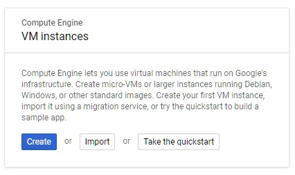
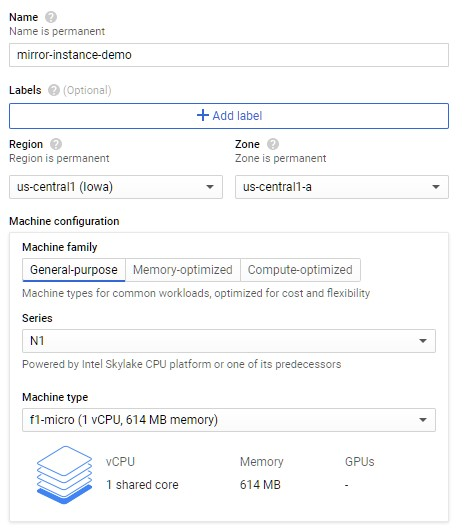
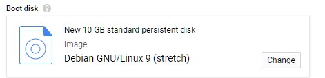
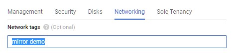
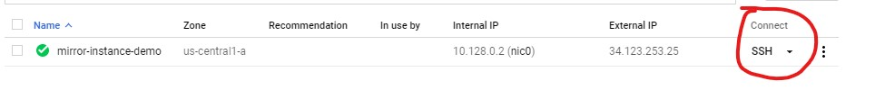
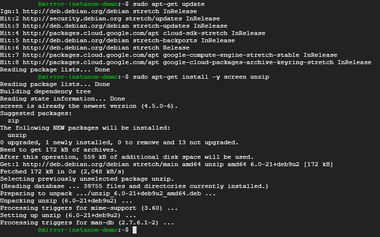
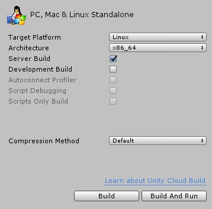
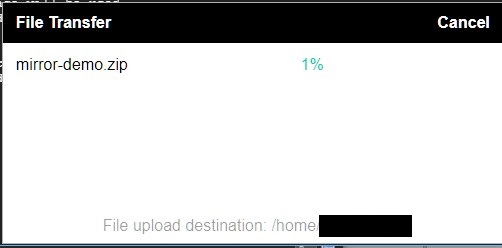

# Google Cloud Services

This guide will explain how to set up a Linux server running on [Google Cloud](https://cloud.google.com/).

Google cloud offers $300 free credits to new users for a limited time, and it also have "Always free products". See [overview](https://cloud.google.com/free) and [docs](https://cloud.google.com/free/docs/gcp-free-tier) for more information.


## Before you begin

1) In the Cloud Console, on the project selector page, select or create a Cloud project.

> Note: If you don't plan to keep the resources that you create in this procedure, create a project instead of selecting an existing project. After you finish these steps, you can delete the project, removing all resources associated with the project.

**[Go to the project selector page](https://console.cloud.google.com/projectselector2/home/dashboard)**

2) You may need to enable billing for your Google Cloud project. If you have free credits (see above) then these will be used first. [Learn how to confirm billing is enabled for your project.](https://cloud.google.com/billing/docs/how-to/modify-project)

## Setting up a new Server

Start by creating and configuring a new Compute Engine instance.

1) In the Cloud Console, go to the VM instances page:

**[Go to the VM instances page](https://console.cloud.google.com/compute/instances)**

If this is your first instance you will see a dialog prompting you to create a new virtual machine



2) Click Create to get started.

3) On the Create an instance page, configure your instance as follows:

    - Name your instance. This tutorial uses the instance name `mirror-instance-demo` throughout.
    - Select the region and zone in which you want your instance to be hosted. This tutorial uses the region `us-central1 (Iowa)` and the zone `us-central1-a` throughout.
    - Machine configuration depends on the size of your game. For a simple example we can use a small server.
        - select `N1` for series
        - select `f1-micro` for machine type
    - In the Boot disk section, click Change. The Boot disk dialog will pop up.
    - Change the disk type to SSD Persistent Disk.



4) Boot disk can be left as default `10gb standard persistent disk` with `Debian GNU/Linux 9 (stretch)` for this tutorial.

You may want to change it to best fit your needs. You can instead use an ssd or increase its size, however this will increase the monthly cost. 



>  Note: The monthly estimate should be shown at the top right next to `Name`

5) To configure Network settings first example the `Management, security, disks, networking, solo tenancy` section, then click on the `Networking` tab.


6) Set a Network tag, this will allow you to set up firewall rules later on.

This tutorial use `mirror-demo` as the tag



7) Set up a static IP address for your instance

    a) Under **Network interfaces** click on `default` and it will bring up a config menu

    b) Select the **External IP** dropdown and select `Create IP address`

    c) Enter a name for this ip and press **Reserve**. For this tutorial we will use `mirror-demo-ip`


8) Create your instance. 

Press the **Create** button at the bottom of the page to finish set up and create your instance

## Configure Firewall

This will allow other people to connect to your server using its IP and port

1) In the Cloud Console, go to the Firewall page.

**[Go to the Firewall page](https://console.cloud.google.com/networking/firewalls/list)**

2) Click Create firewall rule.

3) On the Create a firewall rule page, fill out the form as follows:

    - Name: `mirror-demo-rule`
    - Target tags: `mirror-demo`
    - Source filter: IP ranges
    - Source IP ranges: 0.0.0.0/0
    - Protocols or ports: Select TCP, and then enter port 7777 into the field provided.
      - If you're using the default Kcp Transport in your Network Manager instead of the Telepathy Transport, then you will need to use UDP instead. If you are using a different transport or have configured it to use a different port then you will need to use those settings.


4) Press **Create** to confirm setting and create the rule.

## Connect to your new instance

Once your instance has finished being created you can press the **SSH** button to connect to your instance in your web browser



## Setting up the linux instance

When you first connect you will need to set up a few things

1) First update the list of packages
```sh
sudo apt-get update
```

2) Install `screen` and `unzip` 
```sh
sudo apt-get install -y screen unzip
```

`screen` allows you to have multiple terminals, allows you do do other stuff while your game is running

`unzip` unzips can be used to extract files from a ZIP file after you upload it to the instance 



## Build your game

Build your game with Target Platform `Linux` and **Server Build** ticked




## Upload and extract your game

Once you have built your game zip the folder so that you can upload it to your server.

In the SSH connection window click on the settings cogwheel and select **Upload File** then find and select your zipped build folder.


This should upload the game folder to the home directory.

If you need to go to the home directory you can use: 
```sh
cd ~
```

> Note: the destination will be `/home/username` where username should be the cloud account you are logged into. 



Once your file has finished upload you can extract the files

```sh
unzip ./mirror-demo.zip 
```

## Run server

1) Move into game folder
```sh
cd mirror-demo
```

2) Mark game as executable
```sh
chmod +x ./mirror-demo.x86_64 
```

You should now be able to run your game server!

The following is optional but will most likely be useful

3) Start your server in a detached screen

```sh
screen -d -m -S mirrorServer ./mirror-demo.x86_64 -logfile ~/server.log
```

The parts of the command above:
- `screen -d -m` will create the new terminal in detached mode
- `-S mirrorServer` name of the screen
- `./mirror-demo.x86_64` your game server file
- `-logfile ~/server.log` unity argument for log file location, this will create a log file in the home directory


4) Create start file so you can start your server the same way each time

    a) create `start.sh`
    ```
    echo "screen -d -m -S mirrorServer ./mirror-demo.x86_64 -logfile ~/server.log" > ./start.sh
    ```

    b) mark as executable
    ```sh
    chmod +x ./start.sh 
    ```

5) Run your server
```sh
./start.sh
```

### Using Screen

Here are a few useful commands for using `screen`

- List active screens
```sh
screen -ls
```

- Attach to existing screen, 
    - process-id is show when calling `screen -ls`
    - screen name is given by `-S` when creating the screen, for this tutorial it was `mirrorServer`
```sh
screen -r <process-id | screen name>
```

- Detach from screen press `CTRL A + D`

- Stop your game

Once attached to a screen you can press `CTRL + C` to stop the process, this will stop your game and close the screen


### View log files

You can use the `-logfile ~/path/to/log.log` argument for Unity when starting your game server. This will cause the logs to be written to a file instead of to the terminal. This will means recent logs wont show up in `screen -r`.

- you can use the `tail` command to view the the end of the log file

```sh
tail -n 50 ./server.log 
```
- you can use the `-n` argument to set how many lines to show

- you can use the `-f` argument follow the end of the file stream showing you any new logs that are written to the file in real time. You will need to press `CTRL + C` to exit follow mode


## Clean up after tutorial

If you used an existing project you will need to delete the following:
- VM instance
- Firewall rule


If you have created a new project you should be able to just delete the project. 

**[Go to the Manage resources page](https://console.cloud.google.com/iam-admin/projects)**

