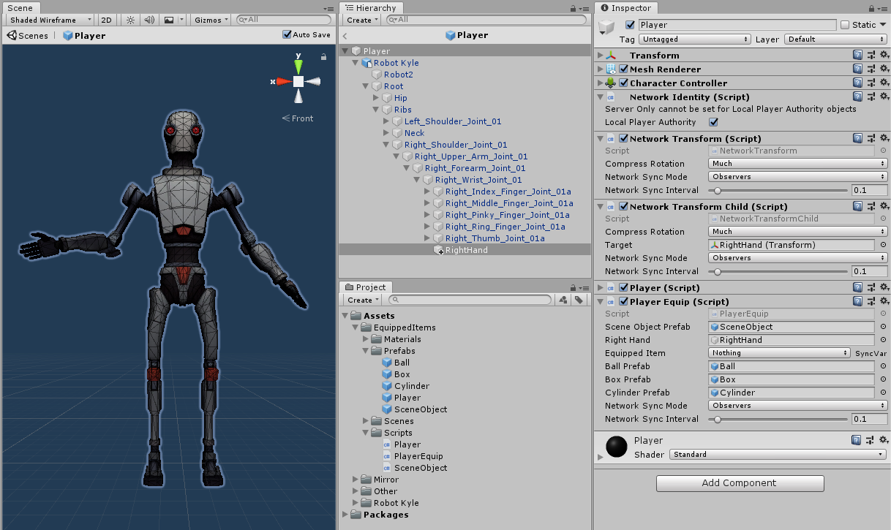

# Pickups, Drops, and Child Objects

Frequently the question comes up about how to handle objects that are attached as children of the player prefab that all clients need to know about and synchronize, such as which weapon is equipped, picking up networked scene objects, and players dropping objects into the scene.

>   Mirror cannot support multiple Network Identity components within an object hierarchy. Since the Player object must have a Network Identity, none of its descendant objects can have one.

## Child Objects

Let's start with the simple case of a single attachment point that is somewhere down the hierarchy of our Player, such as a hand at the end of an arm. In a script that inherits from NetworkBehaviour on the Player Prefab, we'd have a `GameObject` reference where the attachment point can be assigned in the inspector, a SyncVar enum with various choices of what the player is holding, and and a Hook for the SyncVar to swap out the art of the held item based on the new value.

In the image below, Kyle has an empty game object, `RightHand`, added to the wrist, and some prefabs to be equipped (Ball, Box, Cylinder), and a Player Equip script to handle them.

>   **NOTE**: The item prefabs are *art only*...they have no scripts, and they *must not* have networking components. They can have monobehaviour-based scripts, of course, which can be referenced and called from ClientRpc's on the player prefab.

The inspector shows `RightHand` assigned in 2 places, the Player Equip script, as well as the target of the Network Transform Child component, so we could adjust the relative position of the attachment point (not the art) for all clients as needed.



Below is the Player Equip script to handle the changing of the equipped item, and some notes for consideration:
-   While we could just have all the art items attached at design time and just enable / disable them based on the enum, this doesn't scale well to a lot of items and if they have scripts on them for how they behave in the game, such as animations, special effects, etc. it could get ugly pretty fast, so this example locally instantiates and destroys instead as a design choice.
-   The example makes no effort to deal with position offset between the item and the attach point, e.g. having the grip or handle of an item align with the hand. This is best dealt with in a monobehaviour script on the item that has public fields for the local position and rotation that can be set in the designer and a bit of code in Start to apply those values in local coordinates relative to the parent attach point.

``` cs
using UnityEngine;
using System.Collections;
using Mirror;

public enum EquippedItem : byte
{
    nothing,
    ball,
    box,
    cylinder
}

public class PlayerEquip : NetworkBehaviour
{
    public GameObject sceneObjectPrefab;

    public GameObject rightHand;

    public GameObject ballPrefab;
    public GameObject boxPrefab;
    public GameObject cylinderPrefab;

    [SyncVar(hook = nameof(OnChangeEquipment))]
    public EquippedItem equippedItem;

    void OnChangeEquipment(EquippedItem oldEquippedItem, EquippedItem newEquippedItem)
    {
        StartCoroutine(ChangeEquipment(newEquippedItem));
    }

    // Since Destroy is delayed to the end of the current frame, we use a coroutine
    // to clear out any child objects before instantiating the new one
    IEnumerator ChangeEquipment(EquippedItem newEquippedItem)
    {
        while (rightHand.transform.childCount > 0)
        {
            Destroy(rightHand.transform.GetChild(0).gameObject);
            yield return null;
        }

        switch (newEquippedItem)
        {
            case EquippedItem.ball:
                Instantiate(ballPrefab, rightHand.transform);
                break;
            case EquippedItem.box:
                Instantiate(boxPrefab, rightHand.transform);
                break;
            case EquippedItem.cylinder:
                Instantiate(cylinderPrefab, rightHand.transform);
                break;
        }
    }

    void Update()
    {
        if (!isLocalPlayer) return;

        if (Input.GetKeyDown(KeyCode.Alpha0) && equippedItem != EquippedItem.nothing)
            CmdChangeEquippedItem(EquippedItem.nothing);
        if (Input.GetKeyDown(KeyCode.Alpha1) && equippedItem != EquippedItem.ball)
            CmdChangeEquippedItem(EquippedItem.ball);
        if (Input.GetKeyDown(KeyCode.Alpha2) && equippedItem != EquippedItem.box)
            CmdChangeEquippedItem(EquippedItem.box);
        if (Input.GetKeyDown(KeyCode.Alpha3) && equippedItem != EquippedItem.cylinder)
            CmdChangeEquippedItem(EquippedItem.cylinder);
    }

    [Command]
    void CmdChangeEquippedItem(EquippedItem selectedItem)
    {
        equippedItem = selectedItem;
    }
}
```

## Dropping Items

Now that we can equip the items, we need a way to drop the current item into the world as a networked item. Remember that, as child art, the item prefabs have no networking components on them at all.

First, let's add one more Input to the Update method above, and a `CmdDropItem` method:

``` cs
    void Update()
    {
        if (!isLocalPlayer) return;

        if (Input.GetKeyDown(KeyCode.Alpha0) && equippedItem != EquippedItem.nothing)
            CmdChangeEquippedItem(EquippedItem.nothing);
        if (Input.GetKeyDown(KeyCode.Alpha1) && equippedItem != EquippedItem.ball)
            CmdChangeEquippedItem(EquippedItem.ball);
        if (Input.GetKeyDown(KeyCode.Alpha2) && equippedItem != EquippedItem.box)
            CmdChangeEquippedItem(EquippedItem.box);
        if (Input.GetKeyDown(KeyCode.Alpha3) && equippedItem != EquippedItem.cylinder)
            CmdChangeEquippedItem(EquippedItem.cylinder);

        if (Input.GetKeyDown(KeyCode.X) && equippedItem != EquippedItem.nothing)
            CmdDropItem();
    }
```

``` cs
    [Command]
    void CmdDropItem()
    {
        // Instantiate the scene object on the server
        Vector3 pos = rightHand.transform.position;
        Quaternion rot = rightHand.transform.rotation;
        GameObject newSceneObject = Instantiate(sceneObjectPrefab, pos, rot);

        // set the RigidBody as non-kinematic on the server only (isKinematic = true in prefab)
        newSceneObject.GetComponent<Rigidbody>().isKinematic = false;

        SceneObject sceneObject = newSceneObject.GetComponent<SceneObject>();

        // set the child object on the server
        sceneObject.SetEquippedItem(equippedItem);

        // set the SyncVar on the scene object for clients
        sceneObject.equippedItem = equippedItem;

        // set the player's SyncVar to nothing so clients will destroy the equipped child item
        equippedItem = EquippedItem.nothing;

        // Spawn the scene object on the network for all to see
        NetworkServer.Spawn(newSceneObject);
    }
```

In the image above, there's a `sceneObjectPrefab` field that is assigned to a prefab that will act as a container for our item prefabs. The SceneObject prefab has a SceneObject script with a SyncVar like the Player Equip script, and a SetEquippedItem method that takes the shared enum value as a parameter.

``` cs
using UnityEngine;
using System.Collections;
using Mirror;

public class SceneObject : NetworkBehaviour
{
    [SyncVar(hook = nameof(OnChangeEquipment))]
    public EquippedItem equippedItem;

    public GameObject ballPrefab;
    public GameObject boxPrefab;
    public GameObject cylinderPrefab;

    void OnChangeEquipment(EquippedItem oldEquippedItem, EquippedItem newEquippedItem)
    {
        StartCoroutine(ChangeEquipment(newEquippedItem));
    }

    // Since Destroy is delayed to the end of the current frame, we use a coroutine
    // to clear out any child objects before instantiating the new one
    IEnumerator ChangeEquipment(EquippedItem newEquippedItem)
    {
        while (transform.childCount > 0)
        {
            Destroy(transform.GetChild(0).gameObject);
            yield return null;
        }

        // Use the new value, not the SyncVar property value
        SetEquippedItem(newEquippedItem);
    }

    // SetEquippedItem is called on the client from OnChangeEquipment (above),
    // and on the server from CmdDropItem in the PlayerEquip script.
    public void SetEquippedItem(EquippedItem newEquippedItem)
    {
        switch (newEquippedItem)
        {
            case EquippedItem.ball:
                Instantiate(ballPrefab, transform);
                break;
            case EquippedItem.box:
                Instantiate(boxPrefab, transform);
                break;
            case EquippedItem.cylinder:
                Instantiate(cylinderPrefab, transform);
                break;
        }
    }
}
```

In the run-time image below, the Ball(Clone) is attached to the `RightHand` object, and the Box(Clone) is attached to the SceneObject(Clone), which is shown in the inspector.

>   The art prefabs have simple colliders on them (sphere, box, capsule).  If your art item has a mesh collider, it must be marked as Convex to work with the RigidBody on the SceneObject container.


## Pickup Items

Now that we have a box dropped in the scene, we need to pick it up again. To do that, a `CmdPickupItem` method is added to the Player Equip script:

``` cs
    // CmdPickupItem is public because it's called from a script on the SceneObject
    [Command]
    public void CmdPickupItem(GameObject sceneObject)
    {
        // set the player's SyncVar so clients can show the equipped item
        equippedItem = sceneObject.GetComponent<SceneObject>().equippedItem;

        // Destroy the scene object
        NetworkServer.Destroy(sceneObject);
    }
```

This method is simply called from `OnMouseDown` in the Scene Object script:

``` cs
    void OnMouseDown()
    {
        NetworkClient.connection.identity.GetComponent<PlayerEquip>().CmdPickupItem(gameObject);
    }
```

Since the SceneObject(Clone) is networked, we can pass it directly through to `CmdPickupItem` on the player object to set the equipped item SyncVar and destroy the scene object.

For this entire example, the only prefab that needs to be registered with Network Manager besides the Player is the SceneObject prefab.


