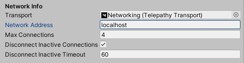

# Handling client disconnects

Mirror provides ample opportunity to react to client disconnections, as well as the means to instigate client disconnect from the server. A networked application should preferably implement graceful termination of the connection - ideally take the client to an offline scene, for example, and allow for the opportunity to reconnect.

In either case of a) the client itself terminating a connection or experiencing a disconnection, or b) the server dropping the client, the networked objects of which the client has authority will be destroyed by the server. This is the intended design; keep in mind [Authority](Authority) is a way of deciding who owns an object and has control over it; so these objects must have their ownership transferred to the server and/or other clients, if they are to 'survive' when their owner is terminated.


## Default disconnection strategy

The NetworkManager includes settings to indicate if and when a client should be automatically disconnected, for lack of activity. The settings are named 'Disconnect Inactive Connections', a boolean that, if set to true, will ensure disconnection of inactive clients within the number of seconds in the 'Disconnect Inactive Timeout' setting.



This is a good starting point for acting on client disconnections. Ordinarily clients communicate with the server - or host, if a client acts as both server and client - many times per second. So it would be highly unusual for a period of several seconds of activity, in which case it becomes prudent for the server to disconnect the client. 

Please note how the server simply disconnects with client, without further ado. The client is still responsible for acting on this disconnect. This is covered below.


## Acting on disconnects

The NetworkManager offers the possibility to override a [OnClientDisconnect](https://mirror-networking.com/docs/api/Mirror.NetworkManager.html#Mirror_NetworkManager_OnClientDisconnect_Mirror_NetworkConnection_) method, which can allow for custom functionality on the client when said client disconnects. For example:

```cs
public class CustomNetworkManager : NetworkManager
{
    public override void OnClientDisconnect(NetworkConnection conn)
    {
        /*
         *  Execute custom functionality to react, client-side, to disconnects here. For example, send the client to an offline-scene.
         */

        base.OnClientDisconnect(conn);
    }
}
```

Similarly, the [OnServerDisconnect](https://mirror-networking.com/docs/api/Mirror.NetworkManager.html#Mirror_NetworkManager_OnServerDisconnect_Mirror_NetworkConnection_) method is called on the server, as opposed to the client, which can be overridden to allow for custom functionality on the server when any client disconnects. For example:

```cs
public class CustomNetworkManager : NetworkManager
{
    public override void OnServerDisconnect(NetworkConnection conn)
    {
        /*
         *  Execute custom functionality to react, server-side, to disconnects here.
         */

        base.OnServerDisconnect(conn);
    }
}
```


## Deliberately disconnecting the client

The preferred way for a client to deliberately disconnect itself is to call the [StopClient()](https://mirror-networking.com/docs/api/Mirror.NetworkManager.html#Mirror_NetworkManager_StopClient) function on the NetworkManager. This will in turn call several other functions on the underlying NetworkClient, such as [Disconnect()](https://mirror-networking.com/docs/api/Mirror.NetworkClient.html#Mirror_NetworkClient_Disconnect) and [ShutDown()](https://mirror-networking.com/docs/api/Mirror.NetworkClient.html#Mirror_NetworkClient_Shutdown). These functions take care of graceful shut-downs of the transport and such. StopClient(), however, goes further and attends also to shutting down authentication, if implemented, as well as turning the client over to any dedicated offline-scene configured with the NetworkManager.

For the purpose of disconnecting all clients, the NetworkServer-class has two suitable methods; [DisconnectAll()](https://mirror-networking.com/docs/api/Mirror.NetworkServer.html#Mirror_NetworkServer_DisconnectAll) and [DisconnectAllConnections()](https://mirror-networking.com/docs/api/Mirror.NetworkServer.html#Mirror_NetworkServer_DisconnectAllConnections). The former disconnects all clients, even a client who is both host and client at the same time. The latter disconnects all clients who are not also host. Therefore, use DisconnectAllConnections() if in a host+client scenario.


## Disconnects at the transport level

Mirror's high-level API abstracts away the low-level specificities of the selected transport. These transports may offer their own disconnect-methods, or disconnect-events, that can be handled to further deal with disconnects on a lower level - if, though unlikely, Mirror's high-level approach do not cover a specific scenario.

