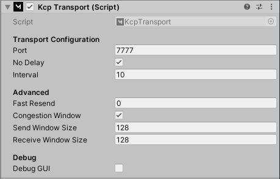

# KCP Transport

**KCP transport for Mirror.**

## About this transport
kcp2k[https://github.com/vis2k/kcp2k] is the new default Transport for Mirror.

Why KCP: https://github.com/skywind3000/kcp/blob/master/README.en.md

+ 100% C#.
+ Works on all platforms except WebGL.
+ Heavy test coverage (83.5%).
+ Extremely fast.
+ Extremely simple.
+ Nearly allocation free*.

"KCP is a fast and reliable protocol that can achieve the transmission effect of a reduction of the average latency by 30% to 40% and reduction of the maximum delay by a factor of three, at the cost of 10% to 20% more bandwidth wasted than TCP. It is implemented by using the pure algorithm, and is not responsible for the sending and receiving of the underlying protocol (such as UDP), requiring the users to define their own transmission mode for the underlying data packet, and provide it to KCP in the way of callback. Even the clock needs to be passed in from the outside, without any internal system calls."

We are very excited about KCP and highly recommend trying it in your project.
=> Previously we had pure C# transports that were slow
=> And native C transports that were fast, but hard to maintain.

KCP brings us the best of both worlds: it's as fast as our native C transports, while still being easy to maintain because it's 100% pure C#!

## Usage
Add the KCPTransport component to your NetworkManager.

## Credits
skywind3000 for original kcp.c (https://github.com/skywind3000/kcp)
kcp-csharp for first C# port (https://github.com/limpo1989/kcp-csharp)
paul/lymdum/uwee for connection handling.
