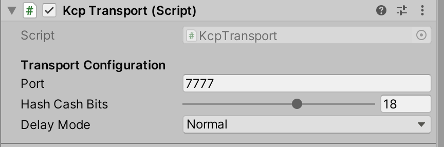

# Kcp Transport

KCP is the default transport in MirrorNG

Simple, message based, MMO Scale UDP networking in C\#.

- Scales to 1000+ clients.
- Zero allocations.
- Portable, works in every platform except webgl
- DoS prevention with [HashCash](http://www.hashcash.org/).
- Data corruption detection with [CRC64](https://en.wikipedia.org/wiki/Cyclic_redundancy_check).
- [reliable and low latency](https://github.com/skywind3000/kcp/blob/master/README.en.md)
- Uses very little CPU and RAM

# Settings

### Port
chose the port the server will listen to
### Hash Cash Bits
Choose how much work clients need to do to connect to your server.  Higher numbers mean it takes longer to connect, which makes it harder to perform a DoS attack on your server. If it is too high, you might annoy your users.
### Delay Mode
Chose normal for lowest bandwidth and CPU usage. Chose Fast3 for lowest latency.