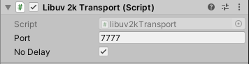

# Libuv2k Transport

**Libuv2k transport for Mirror.**

## About this transport
libuv2k is a TCP transport using libuv(https://github.com/libuv/libuv). 
libuv is the native C networking backend behind Node.js.
It's battle tested and extremely fast.

## Usage
Add the component to your NetworkManager.

## Features
* TCP

## Credits
libuv(https://github.com/libuv/libuv)
