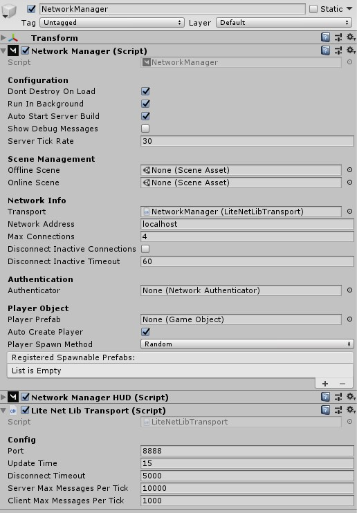

# LiteNetLib Transport

**[LiteNetLib](https://github.com/RevenantX/LiteNetLib) based transport for Mirror.**

Source code: [LiteNetLibTransport](https://github.com/MirrorNetworking/LiteNetLibTransport)

*Old version (not maintained) [LiteNetLib4Mirror](./LiteNetLib4Mirror.md)*

## Usage

1) Download the code from the source folder or package on [Release](https://github.com/MirrorNetworking/LiteNetLibTransport/releases) page.
2) Put the code somewhere in your Assets folder
3) Replace your existing Transport with LiteNetLibTransport on your NetworkManager

## Features

- UDP
- Fully managed code
- Small CPU and RAM usage

see full features of LiteNetLib [here](https://github.com/RevenantX/LiteNetLib)

## Bugs?

Please report any bugs or issues [Here](https://github.com/MirrorNetworking/LiteNetLibTransport/issues)
