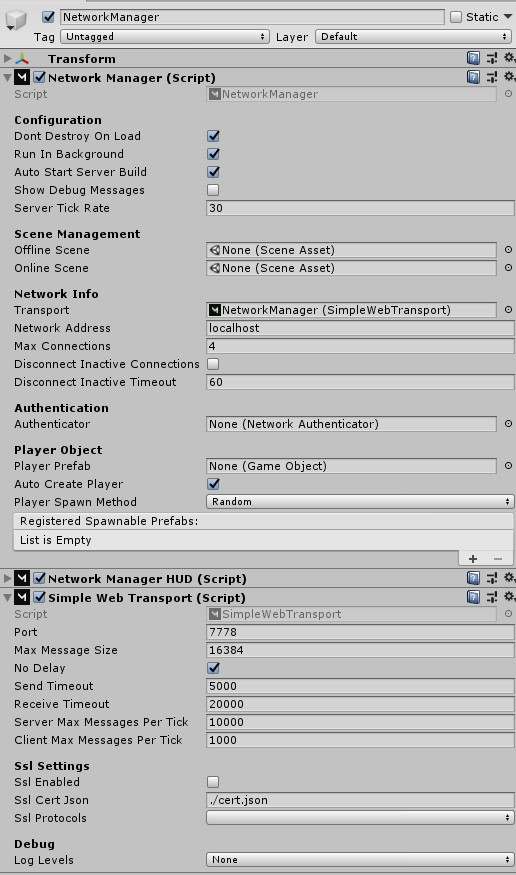

# Simple Web Transport

Transport that uses the websocket protocol. This allows this transport to be used in WebGL builds of unity.

Source code: [SimpleWebTransport](https://github.com/MirrorNetworking/SimpleWebTransport)

## Usage

1) Download the code from the source folder or package on [Release](https://github.com/MirrorNetworking/SimpleWebTransport/releases) page.
2) Put the code somewhere in your Assets folder
3) Replace your existing Transport with SimpleWebTransport on your NetworkManager

## Bugs?

Please report any bugs or issues [Here](https://github.com/MirrorNetworking/SimpleWebTransport/issues)

# Websocket Secure

This transport supports the wss protocol which is required for https pages.

## How to create and setup an SSL Cert

If you host your webgl build on a https domain you will need to use wss which will require a ssl cert.

[See this page](https://github.com/MirrorNetworking/SimpleWebTransport/blob/master/HowToCreateSSLCert.md)

# Logging

Log levels can be set using the dropdown on the transport or or setting `Mirror.SimpleWeb.Log.level`. 

The transport applies the dropdown value in its `Awake` and `OnValidate` methods.

### Log methods

Log methods in this transport use the [ConditionalAttribute](https://docs.microsoft.com/en-us/dotnet/api/system.diagnostics.conditionalattribute?view=netstandard-2.0) so they are removed depending on the preprocessor defines.

These preprocessor defines effect the logging
- `DEBUG` allows warn/error logs 
- `SIMPLEWEB_LOG_ENABLED` allows all logs

Without `SIMPLEWEB_LOG_ENABLED` info or verbose logging will never happen even if log level allows it.

See the [Unity docs](https://docs.unity3d.com/Manual/PlatformDependentCompilation.html) on how set custom defines.
