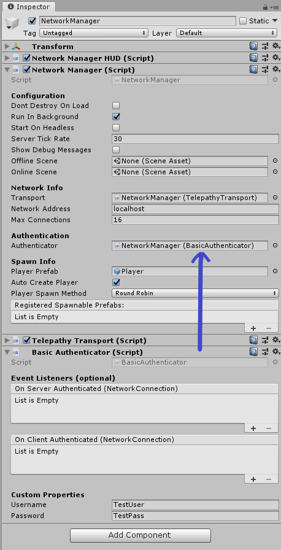

# Basic Authenticator

Mirror includes a Basic Authenticator in the Mirror / Authenticators folder which just uses a simple username and password.
-   Drag the Basic Authenticator script to the inspector of the object in your scene that has Network Manager
-   The Basic Authenticator component will automatically be assigned to the Authenticator field in Network Manager

When you're done, it should look like this:

>   **Note:** You don't need to assign anything to the event lists unless you want to subscribe to the events in your own code for your own purposes. Mirror has internal listeners for both events.
