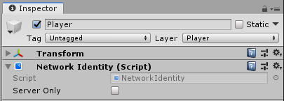
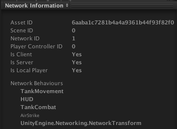

# Network Identity

**See also <xref:Mirror.NetworkIdentity> in the API Reference.**
 
The Network Identity component is at the heart of the Unity networking high-level API. It controls a game object’s unique identity on the network, and it uses that identity to make the networking system aware of the game object. It offers two different options for configuration and they are mutually exclusive, which means either one of the options or none can be checked.
-   **Server Only**  
    Tick this checkbox to ensure that Unity only spawns the game object on the server, and not on clients.

## Instantiated Network Game Objects

With the Mirror’s server-authoritative networking system, the server must spawn networked game objects with network identities, using `NetworkServer.Spawn`. This automatically creates them on clients that are connected to the server, and assigns them a `netId`.

You must put a Network Identity component on any Prefabs that spawn at runtime for the network system to use them. See [Object Spawning](../Guides/GameObjects/SpawnObject.md) for more information.

## Scene-based Network Game Objects

You can also network game objects that are saved as part of your Scene (for example, environmental props). Networking game objects makes them behave slightly differently, because you need to have them spawn across the network.

When building your game, Unity disables all Scene-based game objects with Network Identity components. When a client connects to the server, the server sends spawn messages to tell the client which Scene game objects to enable and what their most up-to-date state information is. This ensures the client’s game does not contain game objects at incorrect locations when they start playing, or that Unity does not spawn and immediately destroy game objects on connection (for example, if an event removed the game object before that client connected). See [Networked Scene Game Objects](../Guides/GameObjects/SceneObjects.md) for more information.

## Preview Pane Information

This component contains network tracking information, and displays that information in the preview pane. For example, the scene ID, network ID and asset ID the object has been assigned. This allows you to inspect the information which can be useful for investigation and debugging.

At runtime there is more information to display here (a disabled NetworkBehaviour is displayed non-bold):

