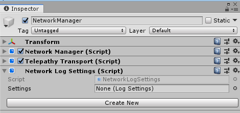
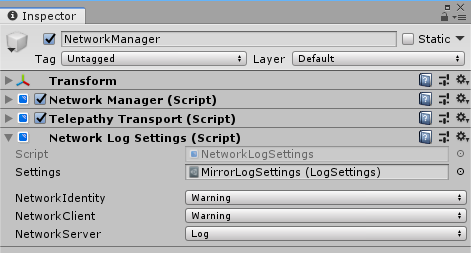
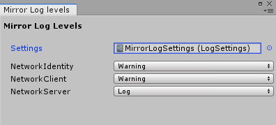

# Network Log Settings

**See also <xref:Mirror.LogFactory> in the API Reference.**

## Network Log Settings component

The Network Log Settings component allows you to use configure logging levels and load the settings in a build.

When you first add NetworkLogSettings you will have to Create a new LogSettings Asset that will store the settings.

*Note: If an LogSettings already exists the NetworkLogSettings component will set the field when it is added*

## Log Settings 

When you first set up LogSettings the list of components may be empty or incomplete. Running the game will make the scripts add their logger to the list so that it's logging level can be changed.

Log settings can also be changed using the "Mirror Log Level" window, Found at "Window/Analysis/Mirror Log Levels".

To change settings at runtime please see <xref:Mirror.LogFactory>.

## Issues

Mirrors Logging api is currently work in progress. If there is a bug or a feature you want added please make an issue [Here](https://github.com/vis2k/Mirror/issues).