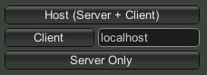
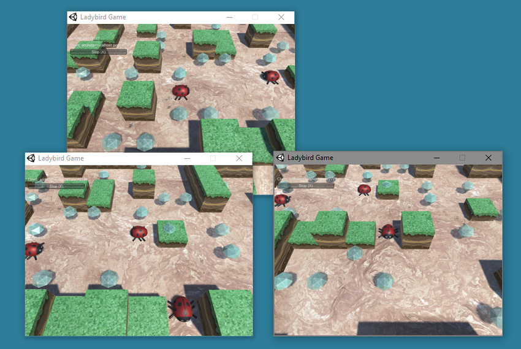

# NetworkManagerHUD

The Network Manager HUD (“heads-up display”) is a quick-start tool to help you start building your multiplayer game straight away, without first having to build a user interface for game creation/connection/joining. It allows you to jump straight into your game play programming, and means you can build your own version of these controls later in your development schedule.

It is not, however, intended to be included in finished games. The idea is that these controls are useful to get you started, but you should create your own UI later on, to allow your players to find and join games in a way that suits your game. For example, you might want to stylize the design of the screens, buttons and list of available games to match the overall style of your game.

To start using the Network Manager HUD, either add the component to the same scene object that has the Network Manager component, or create an empty game object in your scene (menu: game object \> Create Empty) and add the Network Manager HUD component to the new game object.

-   **Show GUI**  
    Tick this checkbox to show the HUD GUI at run time. This allows you to reveal or hide it for quick debugging.
-   **Offset X**  
    Set the horizontal **pixel** offset of the HUD GUI, measured from the left edge of the screen.
-   **Offset Y**  
    Set the vertical pixel offset of the HUD GUI, measured from the top edge of the screen.

The Network Manager HUD provides the basic functions so that people playing your game can start hosting a networked game, or find and join an existing networked game. Unity displays the Network Manager HUD as a collection of simple UI buttons in the Game view.

## Using the HUD

The Network Manager HUD starts in LAN Host mode, and displays buttons relating to hosting and joining a  multiplayer game.

### LAN Host

Click the LAN Host button to start a game as a host on the local network. This client is both the host *and* one of the players in the game. It uses the information from the Network Info section in the inspector to host the game.

When you click this button, the HUD switches to a simple display of network details, and a Stop button which allows you to stop hosting the game and return to the main HUD menu.

When you have started a game as a host, other players of the game can then connect to the host to join the game.

Click the Stop button to disconnect from the host. Clicking Stop also returns to the main HUD menu.

### LAN Client

To connect to a host on the internet use the text field to the right of the LAN Client button to specify the address of the host. The default host address is “localhost”, which means the client looks on its own computer for the game host.  In addition to *localhost*, you can specify an IPv4 address, and IPv6 address, or a fully-qualified domain name (FQDN), e.g. *game.example.com*, and the transport with resolve the name using DNS.  Click LAN Client to attempt to connect to the host address you have specified.

Use the default “localhost” in this field if you are running multiple instances of your game on one computer, to test multiplayer interactivity. To do this, you can create a standalone build of your game, and then launch it multiple times on your computer. This is a common way to quickly test that your networked game interactions are functioning as you expect, without you needing to deploy your game to multiple computers or devices.

When you want to test your game on multiple machines you need to put the address of the computer acting as host into the address text field.

The computer acting as the host needs to tell their IP address to everyone running clients, so that you can type this into the box.  For local clients on a LAN, that's the local IP address.  For remote clients, that's the WAN IP address of the router of the host.  Firewall rules and port-forwarding are generally required for a computer to act as host and accept connections from other computers, whether they're on the LAN or the internet.

Enter the IP address (or leave it as “localhost” if you are testing it on your own machine), then click LAN Client to attempt to connect to the host.

When the client is attempting to connect, the HUD displays a Cancel Connection Attempt button. Click this if you want to stop trying to connect to the host.

If the connection is successful, the HUD displays the Stop button. Click this if you want to stop the game on the client and disconnect from the host:

### LAN Server Only

Click LAN Server Only to start a game which acts as a server that other clients can connect to, but which does not act as a client to the game itself. This type of game is often called a “dedicated server”. A user cannot play the game on this particular instance of your game. All players must connect as clients, and nobody plays on the instance that is running as the server.

A dedicated server results in better performance for all connected players, because the server doesn’t need to process a local player’s game play in addition to acting as server.

You might also choose this option if you want to host a game that can be played over the internet (rather than just within a local network), but want to maintain control of the server yourself - for example, to prevent cheating by one of the clients, because only the server has authority over the game. To do this, you would need to run the game in Server Only mode on a computer with a public IP address.
