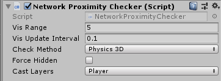

# NetworkProximityChecker

The Network Proximity Checker component controls the visibility of game objects for network clients, based on proximity to players.

-   **Vis Range**  
    Define the range that the game object should be visible to observers.
-   **Vis Update Interval**  
    Define how often (in seconds) the game object should check for observers entering its visible range.
-   **Check Method**  
    Define which type of physics (2D or 3D) to use for proximity checking.
-   **Force Hidden**  
    Tick this checkbox to hide this object from all players.

With the Network Proximity Checker, a game running on a client doesn’t have information about game objects that are not visible. This has two main benefits: it reduces the amount of data sent across the network, and it makes your game more secure against hacking.

This component relies on physics to calculate visibility, so observer game objects must also have a collider component on it.

A game object with a Network Proximity Checker component must also have a Network Identity component. When you create a Network Proximity Checker component on a game object, Mirror also creates a Network Identity component on that game object if it does not already have one.

Scene objects with a Network Proximity Checker component are disabled when they're out of range, and spawned objects are destroyed when they're out of range.
