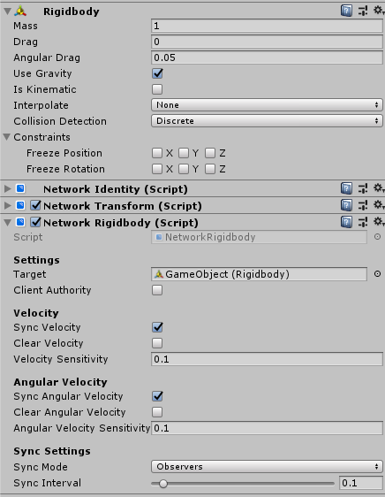

# Network Rigidbody

> The Network Rigidbody classed as "Experimental" for now so please share any problems or bugs you find with it and use at your own risk if production builds. 

The Network Rigidbody component synchronizes velocity and other properties of a rigidbody across the network. This component is useful when you have a non-kinematic rigidbody that have constant forces applied to them, like gravity, but also want to apply forces or change velocity to that rigidbody or server or client with authority. For example, objects that move and jump using rigidbody using gravity.

A game object with a Network Rigidbody component must also have a Network Identity component. When you add a Network Rigidbody component to a game object, Mirror also adds a Network Identity component on that game object if it does not already have one.

Network Rigidbody works best when there is also a NetworkTransform for the object to keep position as well as velocity in sync.

By default, Network Rigidbody is server-authoritative unless you check the box for **Client Authority**. Client Authority applies to player objects as well as non-player objects that have been specifically assigned to a client, but only for this component. With this enabled, value changes are send from the client to the server.

The **Sensitivity** options allow you to set a minimum thresholds before values are send over network. This helps minimize network traffic for very small changes.

For some object you may not want them to rotate but don't need to sync the Angular Velocity. The **Clear Angular Velocity** will set the Angular Velocity to zero each frame causing the minimizing when objects rotation. The same can apply to **Clear Velocity**. If **Clear Velocity Velocity** is enabled then clear is ignored.

Normally, changes are sent to all observers of the object this component is on. Setting **Sync Mode** to Owner Only makes the changes private between the server and the client owner of the object.

You can use the **Sync Interval** to specify how often it syncs (in seconds). This applies both to Client Authority and Server Authority.
