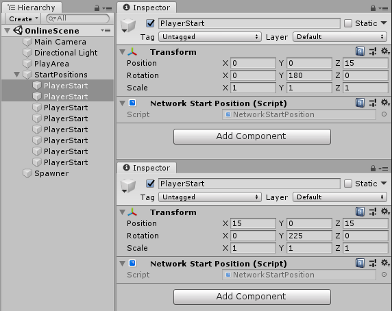

# Network Start Position

To control where players are spawned, you can use the Network Start Position component.

To use these, attach a Network Start Position component to a game object in the scene, and position the game object where you would like one of the players to start. You can add as many start positions to your Scene as you like. The Network Manager detects all start positions in your Scene, and when it spawns each player instance, it uses the position and orientation of one of them.

The Network Manager will spawn players at (0, 0, 0) by default. Adding this component to a game object will automatically register/unregister its game object's transform to the Network Manager as an available spawning position.

Depending on the Network Manager Player Spawn Method setting the spawning is either Random (possible that the same spawn position will be used by two or more players) or Round Robin (use every available position, until there are more clients than spawn points).

