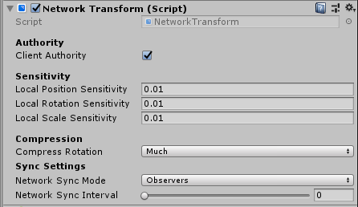

# Network Transform

<https://www.youtube.com/watch?v=Z0th49NERl4&list=PLkx8oFug638oBYF5EOwsSS-gOVBXj1dkP&index=3>

The Network Transform component synchronizes the position, rotation, and scale of networked game objects across the network.

A game object with a Network Transform component must also have a Network Identity component. When you add a Network Transform component to a game object, Mirror also adds a Network Identity component on that game object if it does not already have one.

By default, Network Transform is server-authoritative unless you check the box for **Client Authority**. Client Authority applies to player objects as well as non-player objects that have been specifically assigned to a client, but only for this component.  With this enabled, position changes are send from the client to the server.

Under **Sensitivity**, you can set the minimum thresholds of change to the transform values in order for network messages to be generated. This helps minimize network "noise" for minor twitch and jitter.

Normally, changes are sent to all observers of the object this component is on.  Setting **Sync Mode** to Owner Only makes the changes private between the server and the client owner of the object.

You can use the **Sync Interval** to specify how often it syncs (in seconds).
