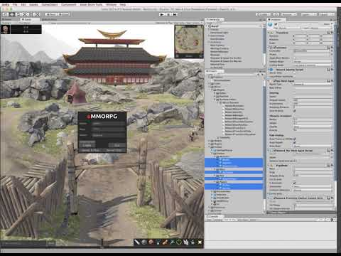

# Migration Guide

## Migrating a project from UNet (HLAPI)

This guide gives you a step by step instruction for migrating your project from HLAP to Mirror. Mirror is a fork of UNet. As such the migration is straight forward for most projects.

You should review the information on the [Deprecations](Deprecations.md) page to see if your project will be impacted.

There's also a Migration Tool you can try:  
<https://github.com/Lymdun/MirrorConverter/>

### 1. BACKUP

You have been warned.

### 2. Install Mirror and Restart Unity

Get Mirror from the [asset store](https://assetstore.unity.com/packages/tools/network/mirror-129321) and import it in your project.  

Alternatively you can grab the latest [release](https://github.com/vis2k/Mirror/releases) from GitHub if you're feeling adventurous, but be aware that bleeding edge dev releases are not necessarily stable.  

**NOTE:** You must restart Unity after adding Mirror to the project for the components menu to update correctly.

### 3. Replace namespace

Replace `UnityEngine.Networking` for `Mirror` everywhere in your project. For example, if you have this:

```cs
using UnityEngine.Networking;

public class Player : NetworkBehaviour
{
    ...
}
```

replace it with:

```cs
using Mirror;

public class Player : NetworkBehaviour
{
    ...
}
```

At this point, you might get some compilation errors. Don't panic, these are easy to fix. Keep going...

### 4. Replace playerController with identity

Replace references to `NetworkConnection.playerController` with `NetworkConnection.identity`. Click [here](PlayerControllerToIdentity.md) for guidance.

### 5. Remove NetworkSettings

NetworkSettings in UNet have channels, but this is flat out broken. Rather than ignoring your settings we removed channels from NetworkSettings completely.  `sendInterval` is now set in code and / or the inspector too.

For example, if you have this code:

```cs
[NetworkSettings(channel=1,sendInterval=0.05f)]
public class NetStreamer : NetworkBehaviour
{
    ...
}
```

replace it with:

```cs
public class NetStreamer : NetworkBehaviour
{
    void Start()
    {
        syncInterval = 0.05f;
    }
}
```

Please note that the default transport [Telpathy](../Transports/Telepathy.md), completely ignores channels, all messages are reliable, sequenced and fragmented. They just work with no fuss. If you want to take advantage of unreliable channels use LLAPITransport instead.

### 6. Change SyncListStruct to SyncList

There is a bug in the original UNet Weaver that makes it mess with our `Mirror.SyncListStruct` without checking the namespace. In Mirror, we fixed SyncLists so that they work with structs by default.

For example, if you have definitions like:

```cs
public class SyncListQuest : SyncListStruct<Quest> { }
```

replace them with:

```cs
public class SyncListQuest : SyncList<Quest> { }
```

### 7. Replace NetworkHash128 and NetworkInstanceId

These have been changed to System.Guid and uint, respectively.

For example, if you have something like this:

```cs
public sealed class SpawnItemMessage : MessageBase
{
    public NetworkHash128 assetID;
    public NetworkInstanceId networkInstanceID;
    public Vector3 position;
    public Quaternion rotation;
}
```

replace with:

```cs
public sealed class SpawnItemMessage : MessageBase
{
    public System.Guid assetID;
    public uint networkInstanceID;
    public Vector3 position;
    public Quaternion rotation;
}
```

### 8. Update your synclist callbacks

In UNet, SyncLists have a callback delegate that gets called in the client whenever the list is updated.  We have changed the callback to be a C\# event instead and we also pass the item that was updated/removed.

For example, if you have this code:

```cs
using UnityEngine;
using UnityEngine.Networking;

public  class MyBehaviour : NetworkBehaviour
{
    public SyncListInt m_ints = new SyncListInt();

    private void OnIntChanged(SyncListInt.Operation op, int index)
    {
        Debug.Log("list changed " + op);
    }

    public override void OnStartClient()
    {
        m_ints.Callback = OnIntChanged;
    }
}
```

replace it with:

```cs
using UnityEngine;
using Mirror;

public  class MyBehaviour : NetworkBehaviour
{
    public SyncListInt m_ints = new SyncListInt();

    private void OnIntChanged(SyncListInt.Operation op, int index, int item)
    {
        Debug.Log("list changed " + op + " item " + item);
    }

    public override void OnStartClient()
    {
        m_ints.Callback += OnIntChanged;
    }
}
```

Notice the callback will also work in the server in Mirror.

### 9. Replace Components

Every networked prefab and scene object needs to be adjusted. They will be using `NetworkIdentity` from Unet, and you need to replace that component with `NetworkIdentity` from Mirror. You may be using other network components, such as `NetworkAnimator` or `NetworkTransform`. All components from Unet should be replaced with their corresponding component from Mirror.

Note that if you remove and add a NetworkIdentity, you will need to reassign it in any component that was referencing it.

### 10. Update Extended Components

Some commonly extended components, such as NetworkManager, have changed method parameters in Mirror. A commonly used override is OnServerAddPlayer. Using the original HLAPI, your override may have looked like this:

```cs
public override void OnServerAddPlayer(NetworkConnection conn, short playerControllerId, NetworkReader extraMessageReader)
{
    base.OnServerAddPlayer(conn, playerControllerId, extraMessageReader);
    // your code
}
```

In your newly Mirror-capable NetworkManager, if you are using the `OnServerAddPlayer` override, remove the "playerControllerId" and "extraMessageReader" parameters from your override and the base call:

```cs
public override void OnServerAddPlayer(NetworkConnection conn)
{
    base.OnServerAddPlayer(conn);
    // your code
}
```

See [Custom Player Spawn Guide](../Guides/GameObjects/SpawnPlayerCustom.md) for details on how to submit custom characters now.

### 11. Pick your transport

You can choose one of several transports in Mirror.  Open your NetworkManager gameobject,   in the inspector you will see a `TelepathyTransport` component by default.  Drag in one of the available transports and remove `TelepathyTransport` if you wish to use a UDP based transport instead.

### 12. Configure address and port

In HLAPI, you configure the port and local address in the NetworkManager. One of our goals is to make Mirror transport independent. Not all transports need address and port.  Some transports might even use more than one port at the same time, so these settings were inadequate. We removed the port and address and all other Network Info properties from NetworkManager,  and we moved them to the transport components instead.

### 13. Update your firewall and router

LLAPI uses UDP. Mirror uses TCP by default. This means you may need to change your router port forwarding and firewall rules in your machine to expose the TCP port instead of UDP. This highly depends on your router and operating system.

## Video version

See for yourself how uMMORPG was migrated to Mirror

[](http://www.youtube.com/watch?v=LF9rTSS3rlI)

## Possible Error Messages
-   TypeLoadException: A type load exception has occurred. - happens if you still have SyncListStruct instead of SyncListSTRUCT in your project.
-   NullPointerException: The most likely cause is that you replaced NetworkIdentities or other components but you had them assigned somewhere. Reassign those references.
-   `error CS0246: The type or namespace name 'UnityWebRequest'  could not be found. Are you missing 'UnityEngine.Networking' using  directive?`

    Add this to the top of your script:
    ```cs
        using UnityWebRequest = UnityEngine.Networking.UnityWebRequest;
    ```
    
    `UnityWebRequest` is not part of UNet or Mirror, but it is in the same namespace as UNet. Changing the namespace to Mirror caused your script not to find UnityWebRequest. The same applies for `WWW` and all `UnityWebRequest` related classes.
