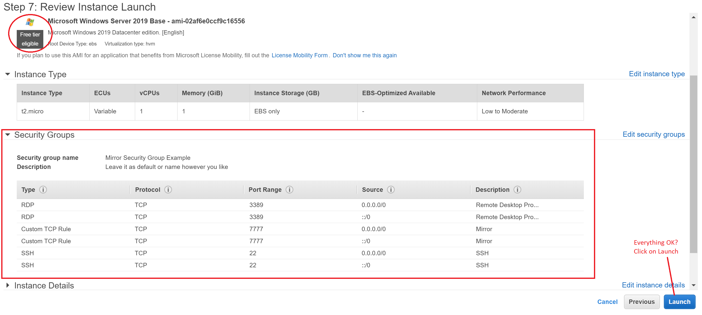
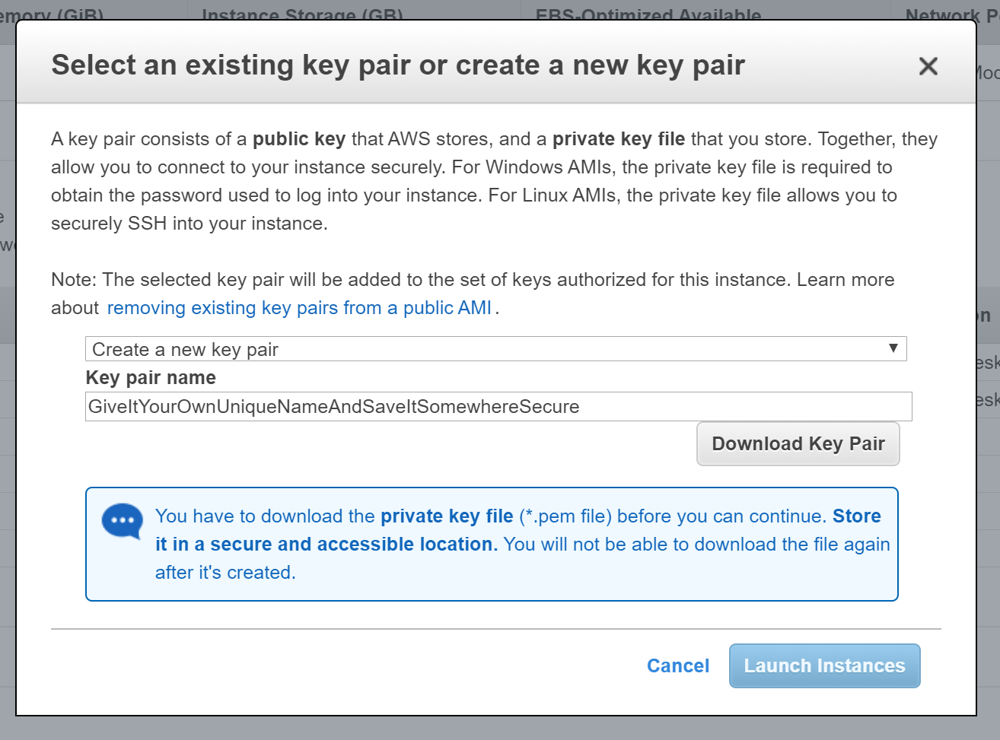

# Amazon Web Services (AWS)

During this section we will focus on using a Windows instance and connecting from a Windows computer.

>   **NOTE**: AWS requires a payment method/credit card added before being able to use a Windows server.

Don't forget to read up on the [free tier limitations](https://docs.aws.amazon.com/awsaccountbilling/latest/aboutv2/billing-free-tier.html).
During this example we will be using the free tier of the EC2 option, which gives us the possibility to use a Windows instance (if you have already added a payment method).
For more information about which services offer a Free Tier, see [AWS Free Tier](https://aws.amazon.com/free/?all-free-tier.sort-by=item.additionalFields.SortRank&all-free-tier.sort-order=asc&awsf.Free%20Tier%20Types=tier%2312monthsfree&awsf.Free%20Tier%20Categories=categories%23compute).

These are the steps we will go through from start to finish:

1. Account creation
2. Setting up an instance with the EC2 Management Console
3. Configuring the server via RDP (Remote Desktop)
4. Setting up the firewall to allow connections through
5. Testing the connection

## 1. Account Creation

Go to the [Account creation page](https://portal.aws.amazon.com/billing/signup?nc2=h_ct&src=default&redirect_url=https%3A%2F%2Faws.amazon.com%2Fregistration-confirmation#/start) and
sign up with your details and payment method (e.g. credit card). Adding the payment method is necessary to run a windows instance on AWS.

## 2. Setting up an instance with the EC2 Management Console
After setting up your account you should be logged in.
Always make sure you're in your correct region so it's a good habit to check in the top right corner. Change it to the closest location to you now.
After this click on Services in the top left corner and click on EC2. This will bring you to the EC2 instance dashboard and ready to Launch your instance!

Click on **"Launch Instance"**.

There are 7 steps to creating your AWS Instance:

1. Choose an Amazon Machine Image (AMI)
2. Choose Instance Type
3. Configure Instance
4. Add Storage
5. Add Tags
6. Configure Security Group
7. Review

#### Step 1: Choose an Amazon Machine Image

Scroll down until you see the Microsoft Windows Server 2019 Base (take the newest one if this is outdated).
Make sure that the option you select has the "Free Tier Eligible" under the icon and click on "Select".

#### Step 2: Choose Instance Type

Make sure you choose the instance type with the "free tier eligible", at the time of writing this is the t2.micro instance.
Click on **"Next: Configure Instance Details"**. **Do not** click on Review and Launch.

#### Step 3: Configure Instance

Nothing has to be changed at this step. Keep it default. Click on **"Next: Add Storage"**.

#### Step 4: Add Storage

Nothing has to be changed. Keep it default. The 30GB is more than you need but there will be an error if you choose a lower amount.
Keep in mind that you can always click "Previous" if you need to return, you do not need to repeat the entire process if you make a mistake (unless you click Launch at the end).

Click on **"Next: Add Tags"** to continue.

#### Step 5: Add Tags

Nothing has to be changed. Keep it default. Click on **"Next: Configure Security Groups"**

#### Step 6: Configure Security Groups

>   **IMPORTANT STEP** This makes it possible to connect to your instance from outside for:

-   RDP (needed for this example)
-   For clients connecting through port 7777 for your Mirror Project.
-   SSH (if needed)

Create a new security group and you can give it your own name and description. Add the following rules:

-   RDP with source "Anywhere", Description can be whatever but put it as Remote Desktop Program.
-   Custom TCP Rule with port 7777 and source "Anywhere", Description can be whatever but put it as Mirror.
-   SSH with source "Anywhere", Description can be whatever but put it as SSH.

SSH is not strictly necessary but can be used to remote connect to it through other means than the RDP.

You can ignore the warning about the source as this is just a testing environment. In the future you might wish to restrict this but you will almost never know the clients' connection IP's beforehand.

Click on **"Next: Review and Launch"**

#### Step 7: Review

Almost there! Make sure everything is correct and you are using the free tier, then click on **"Launch"**.

One more thing: A window will pop up asking for your key pair. Just create a new one by selecting the dropdown: **"Create a new key pair"** and give it a name, click on **"Download Key Pair"**.

Keep the key file (.PEM File) somewhere secure (To be 100% certain, back it up somewhere). 

>   **YOU CANNOT ACCESS THE CREATED INSTANCE WITHOUT THIS KEY**

Now you can (finally) click on **"Launch Instances"**!

Go back to your EC2 dashboard by clicking on "Services" at the top left and clicking on EC2.
Now you see you have "Running Instances: 1". **Click on "Running Instances" to continue**.

>   A new instance might take around 5-10 minutes to set up. Refresh the page after 10 minutes if nothing changes.

Now you did all this but you want to get ON the dedicated server right? Perfect! The next step will get you up and running!

## 3. Configuring the server via RDP (Remote Desktop)

Time to get the RDP file so you can start connecting. There are a few things we'll need:

1. RDP file with the key pair added to it
2. Configure RDP file once downloaded to allow getting files from our C: drive or other drives (so you can easily get your zip project)
3. Enter the windows Admin password once you start the RDP file

Once you've done this, you should be able to continue using the same RDP file.

#### RDP file with the key pair added to it

>   Get the password **before** clicking Download

> **Copy the Password for later**

Now click on **"Download Remote Desktop File"**. The RDP file will be downloaded.

#### Configure RDP file for easy file access

Go to your freshly downloaded RDP file and rightclick it and then click "Edit".

Go to the third tab "Local sources", at the bottom click "more" under local devices and sources. 
On the new window select your C: drive or any other drive. This is your own computer your connecting from. For easy file exchange.

Perfect! Now you can run the RDP file! The RDP file will ask a password. If you forgot your password you can get it back by rightclicking 
the instance and clicking on "Get Windows Password". You will be asked to re-enter your key pair (.PEM) file and decrypt the message.
Once done you will be able to copy the password.

There you have it! Now you have your password and Remote Desktop should show you logging into your dedicated server!

#### Setting up the firewall to allow connections through

Go to the windows firewall settings, go to the advanced firewall settings and go to inbound rules. **Add a new rule** and choose the port type.
Select TCP and enter the 7777 port (or any other if you use another port in Mirror). Continue clicking next and keep things default.
Close all the windows when done.

AWESOME! You now have everything set up to accept incoming requests on **port 7777**.

## 4. Testing the connection

Before you can (finally) test out your server build of your project you need to get it on the dedicated server!

Place your (zipped) server build at the root of your added drive (C: or another) to make it easier to find it fast.

Go to **"My Computer"** and because of our previous changes to the RDP we should now see your local drive under "Devices and Drives".
Double click it and because you placed your zipped server build on that drive, you should see it immediatly when it's done loading.

Now unzip the project in a new folder on the dedicated server's desktop and run it.

Want to test if it sees the 7777 port is open after you started your Mirror server?
Get your IPv4 public IP from the EC2 Management Console from your instance and use it on your client to connect to that IP.

Go to [PortChecker](https://www.portcheckers.com/) and enter the Dedicated Server IP address and enter port 7777.

>   NOTE: If you are not running your game / project then the port will be closed. It's only open when the server is running.
