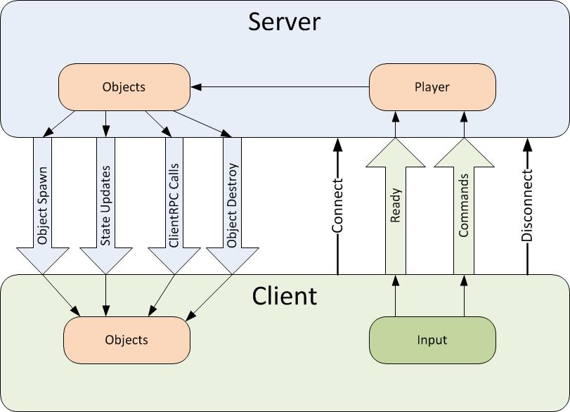

# NetworkBehaviour

**See also <xref:Mirror.NetworkBehaviour> in the API Reference.**

Network Behaviour scripts work with game objects that have a NetworkIdentity component. These scripts can perform high-level API functions such as Commands, ClientRpc's, SyncEvents and SyncVars.

With the server-authoritative system of Mirror, the server must use the `NetworkServer.Spawn` function to spawn game objects with Network Identity components. Spawning them this way assigns them a `netId` and creates them on clients connected to the server.

**Note:** This is not a component that you can add to a game object directly. Instead, you must create a script which inherits from `NetworkBehaviour` (instead of the default `MonoBehaviour`), then you can add your script as a component to a game object.

## Properties
-   **isServer**  
    Returns true if this game object is running on the server, and has been spawned.
-   **isClient**  
    Returns true if this game object is on the client and has been spawned by the server.
-   **isLocalPlayer**  
    Returns true if this game object represents the player created for this client.
-   **hasAuthority**  
    Returns true on the client if this client has [authority](Authority.md) over this game object. It is meaningless in server context.
-   **netId**  
    The unique network ID of this game object. The server assigns this at run time. It is unique for all game objects in that network session.
-   **netIdentity**  
    Returns the NetworkIdentity of this object
-   **connectionToServer**  
    The NetworkConnection associated with the Network Identity component attached to this game object. This is only valid for **player objects** on the client.
-   **connectionToClient**  
    The NetworkConnection associated with the Network Identity component attached to this game object. This is only valid for player game objects on the server.

NetworkBehaviour scripts have the following features:
-   Synchronized variables
-   Network callbacks
-   Server and client functions
-   Sending commands
-   Client RPC calls
-   Networked events



## Network Callbacks

There are built-in callback functions which are invoked on NetworkBehaviour scripts for various network events. These are virtual functions on the base class, so you can override them in your own code like this:

```cs
public class SpaceShip : NetworkBehaviour
{
    public override void OnStartServer()
    {
        // disable client stuff
    }

    public override void OnStartClient()
    {
        // register client events, enable effects
    }
}
```

The built-in callbacks are:
-   **OnStartServer** called on server when a game object spawns on the server, or when the server is started for game objects in the Scene
-   **OnStopServer** called on server when a game object spawns on the server, or when the server is started for game objects in the Scene
-   **OnStartClient** called on clients when the game object spawns on the client, or when the client connects to a server for game objects in the Scene
-   **OnStopClient** called on clients when the server destroys the game object
-   **OnStartLocalPlayer** called on clients for player game objects on the local client (only)
-   **OnStartAuthority** called on clients for behaviours that have authority, based on context and hasAuthority.
-   **OnStopAuthority** called on clients for behaviours when authority is removed.

Note that in a peer-hosted setup, when one of the clients is acting as both host and client, both `OnStartServer` and `OnStartClient` are called on the same game object. Both these functions are useful for actions that are specific to either the client or server, such as suppressing effects on a server, or setting up client-side events.

## Server and Client functions

You can tag member functions in NetworkBehaviour scripts with custom attributes to designate them as server-only or client-only functions. `Server` and `ServerCallback` return immediately if the client is not active. Likewise, `Client` and `ClientCallback` return immediately if the server is not active.

The `Server` and `Client` attributes are for your own custom callback functions. They do not generate compile time errors, but they do emit a warning log message if called in the wrong scope.

The `ServerCallback` and `ClientCallback` attributes are for built-in callback functions that are called automatically by Mirror. These attributes do not cause a warning to be generated.

For more information, see [Attributes](Attributes.md).

## Commands

To execute code on the server, you must use commands. The high-level API is a server-authoritative system, so commands are the only way for a client to trigger some code on the server.

Only player game objects can send commands.

When a client player game object sends a command, that command runs on the corresponding player game object on the server. This routing happens automatically, so it is impossible for a client to send a command for a different player.

To define a command in your code, you must write a function which has:
-   A name that begins with `Cmd`
-   The `Command` attribute

Commands are called just by invoking the function normally on the client. Instead of the command function running on the client, it is automatically invoked on the corresponding player game object on the server.

Commands are type-safe, have built-in security and routing to the player, and use an efficient serialization mechanism for the arguments to make calling them fast.

See [Communications](Communications/index.md) and related sections for more information.

## Client RPC Calls

Client RPC calls are a way for server game objects to make things happen on client game objects.

Client RPC calls are not restricted to player game objects, and may be called on any game object with a Network Identity component.

To define a Client RPC call in your code, you must write a function which:
-   Has a name that begins with `Rpc`
-   Has the `ClientRpc` attribute

See [Communications](Communications/index.md) and related sections for more information.

## Networked Events

Networked events are like Client RPC calls, but instead of calling a function on the game object, they trigger Events instead.

This allows you to write scripts which can register for a callback when an event is triggered.

To define a Networked event in your code, you must write a function which both:
-   Has a name that begins with `Event`
-   Has the `SyncEvent` attribute

You can use events to build powerful networked game systems that can be extended by other scripts. This example shows how an effect script on the client can respond to events generated by a combat script on the server.

SyncEvent is the base class that Commands and ClientRpc calls are derived from. You can use the SyncEvent attribute on your own functions to make your own event-driven networked game play code. Using SyncEvent, you can extend Mirror’s Multiplayer features to better fit your own programming patterns.

See [SyncEvents](Sync/SyncEvent.md) for more details.
