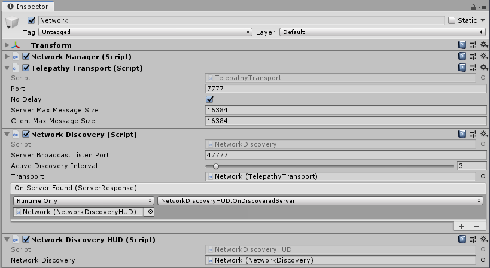

# Network Discovery

Suppose your are next to a friend.  He starts a game in host mode and you want to join him. How will your phone locate his? Finding out his IP address is not exactly intuitive or something kids can do.

To solve this problem you can use Network Discovery. When your game starts, it sends a message in your current network asking "Is there any server available?".  Any server within the same network will reply and provide information about how to connect to it.

Mirror comes with a simple implementation of Network Discovery you can simply use in your game.  It also provides a way for you to extend it so that you can pass additional data during the discovery phase.

## Quick Start

To use Network Discovery follow these steps:

1) Create a gameobject with a NetworkManager if you have not done so already
2) Do not add a NetworkManagerHUD.  Discovery has a different UI component.
3) Add a NetworkDiscoveryHUD component to the NetworkManager gameobject

A NetworkDiscovery component will be automatically added and wired up to your HUD.  Your inspector should look similar to this:



4) Add a player to the network manager if you have not done so.

5) Build and run a standalone version

6) Click on Start Host

7) Start play mode in the editor and click on Find Servers

8) The editor should find the standalone version and display a button

9) Click on the button to connect to it.

The NetworkDiscoveryHUD is provided as a simple and quick way to get started, but you will probably want to replace it with your own user interface.

## Custom Network Discovery

You can completely replace the user interface by adding your own interface (typically Unity UI based) instead of the default NetworkDiscoveryHUD.  You do still need the NetworkDiscovery component to do the heavy lifting.

Sometimes you want to provide more information in the discovery messages. Some use cases could include:

* The client can show if the server is in PvP or PvE mode
* The client can show how full the servers are.
* The client can show the ping to each server so the player can chose the fastest server
* The client can show the language
* The client can show if the server is password protected

To do this, create 2 Messages with whatever data you want to pass.  One message for the request and one message for the response.  For example:

```cs
public class MyDiscoveryRequest : MessageBase
{
    public String language="en";
    // ...
    // add whatever other field you want here
    // This data will be broadcasted by the clients to all computers in your network.

    // No need to provide serialization methods, Mirror will generate them.
}

public class MyDiscoveryResponse : MessageBase
{
    enum GameMode {PvP, PvE};

    // you probably want uri so 
    // clients know how to connect to the server
    public Uri uri;

    public GameMode GameMode;
    public int TotalPlayers;
    public int HostPlayerName;
    // ...

    // add whatever other field you want here
    // This data will be sent from your server to the clients when asked

    // No need to provide serialization methods, Mirror will generate them.
}
```

The next step is to implement a Network Discovery that uses these messages.  Write this class and fill in the overrides.

```cs

public class MyNetworkDiscovery: NetworkDiscoveryBase<MyDiscoveryRequest, MyDiscoveryResponse> 
{
    protected override ServerRequest GetRequest()
    {
        // TODO: Create your request and return it
    }

    protected override MyDiscoveryResponse ProcessRequest(MyDiscoveryRequest request, IPEndPoint endpoint) 
    {
        // TODO: Create your response and return it   
    }

    protected override void ProcessResponse(MyDiscoveryResponse response, IPEndPoint endpoint)
    {
        // TODO: a server replied,  do something with the response such as invoking a unityevent
    }

}
```

NetworkDiscovery.cs is a good example of how to implement these methods.  

