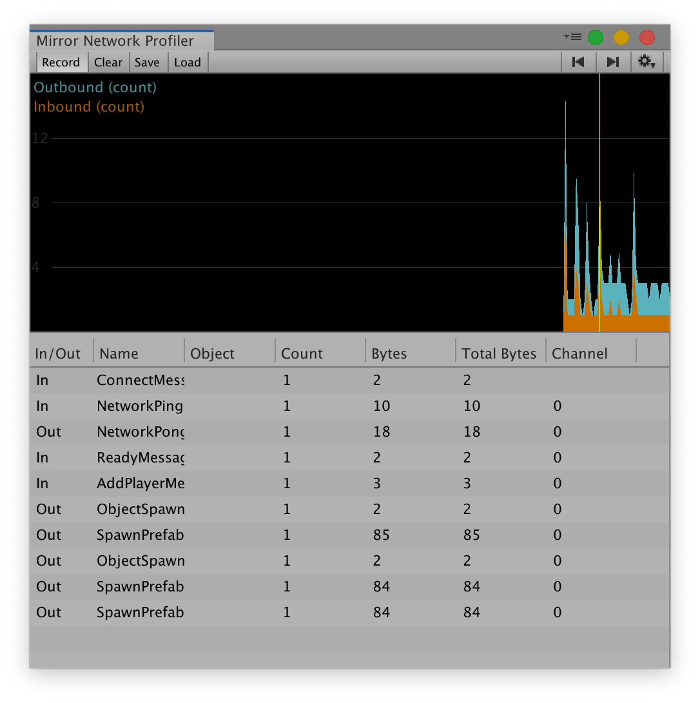

# Mirror Network Profiler

The [mirror profiler](https://mirror-networking.com/download/mirror-profiler/) is part of the Mirror Pro suit.
As of this writing it is accessible to our Github Supporters.

## Installation

1. Make sure you have the latest version of Mirror
2. Become a [Github Supporter](https://github.com/sponsors/vis2k) if you haven't.
3. [Download](https://mirror-networking.com/download/mirror-profiler/) the profiler
4. Install the unity package in your project

## Usage
1. In Unity menu,  click on Open Window -> Analysis -> Mirror Network Profiler.  The profiler view will appear
2. You may dock the profiler anywhere you want
3. Start your game in the editor
4. Press "Record" in the profiler
5. Begin your game as host, client or server
6. At the top a chart will show messages coming in and out   
7. Click the chart to select a frame
8. The profiler will display information about all the messages sent and received in that frame

Currently the messages display the following fields:

* In/Out: Whether the message was received (in) or sent (out)
* Name: Short name of the message,  if the message was a `[Command]`, `[ClientRpc]`, `[TargetRpc]` or `[TargetEvent]`,  this will display the name of the method,  otherwise it will display the name of the message class.
* Bytes: The size of the message in bytes
* Count: In the case of out messages,  this will contain how many clients the message was sent to.
* Total Bytes:  the size of the message multiplied by the amount of clients the message was sent to (Bytes * Count)
* Channel: The channel used to send the message.  As of this writing,  we cannot determine the channel for inbound messages, so it displays -1.  This will be improved in future versions. Transports can use channels for many purposes such as reliable, unreliable, encrypted, compressed, etc.

## Optimizing bandwidth

On most transports, the total bandwidth is dominated by the Count column.  This is because each message is packaged in a TCP or UDP frame,  which have large headers. 

* If you are sending multiple `[Command]` in the same frame,  consider consolidating them into a single `[Command]` call if it makes sense
* If you see a large Count number on a specific message,  consider adding a NetworkProximityChecker to your object,  so that it is only visible to nearby players instead of the entire world. This can dramatically reduce the Count (and total bytes) depending on your game.
* If you are sending a message every single frame,  consider changing your logic so that you only send messages when things change,  or use a timer.
* Consider using SyncToOwner feature so that only the owner gets a message when private information such as inventory changes. This can dramatically reduce the Count depending on your game.
* If you have a lot of `[ClientRpc]` calls that synchronize data,  consider using `[SyncVar]` and synclists instead.  They can reduce the amount of messages because they only send deltas when they change,  plus they get batched together, so hundreds of variables can be synchronized with a single message.
