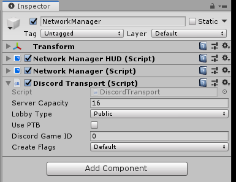

# Discord Transport

Discord Transport is a networking transport that enables sending networking packets via [Discord's Game SDK](https://discordapp.com/developers/docs/game-sdk/sdk-starter-guide).

[Latest Release](https://github.com/Derek-R-S/Discord-Mirror/releases)

[Getting Started](https://github.com/Derek-R-S/Discord-Mirror)

## Features

* Discord's Relay - No need to port forward or worry about NAT issues!
* No IPs - No IPs mean no IP leaks or hassle
* Encryption - Discord automatically encrypts all your data

## Credits
Derek - Made Discord-Mirror
