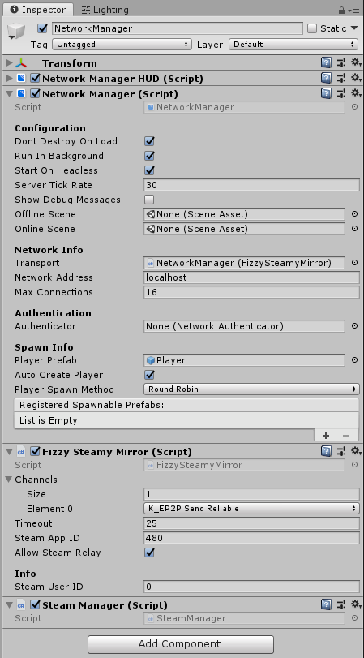

# FizzySteam Transport

Fizzy Steam is a Steam P2P transport for Mirror, it utilizes Steam's P2P service to directly connect or relay your connection to another player. Fizzy Steam is based of [Steamworks.Net](https://github.com/rlabrecque/Steamworks.NET) wrapper.

You can get the release **[Here](https://github.com/Chykary/FizzySteamyMirror/releases)** with the latest version of Steamworks.Net included or you can clone the repo **[Here](https://github.com/Chykary/FizzySteamyMirror)**.

## Features

* Multiple Customizable Channels : You can customize the channels in the transport, whether you want just 1 or 5 channels that are unreliable or reliable (best to leave channel 0 as reliable).
* Steam Nat Punching & Relay : The transport will use Steam to do Nat Punching to your destination, and if that doesn't work, steam's relay Server will be used to ensure you can always connect (latency may vary).
* No Code Changes Needed : If you Already use Mirror, you just need to slap this transport in (maybe add your steam App ID in your build), and everything should work the same like any other Mirror Transport. "It Just Works" -Todd Howard

## Credits
* [Fizz Cube](https://github.com/FizzCube) : Original author for this Transport.
* [Chykary](https://github.com/Chykary/FizzySteamyMirror) : The current maintainer for this Transport.
* [rlabrecque](https://github.com/rlabrecque) : Creator of Steamworks.Net.
* [vis2k](https://github.com/vis2k) : Creator of Mirror.
* Valve : Steam
