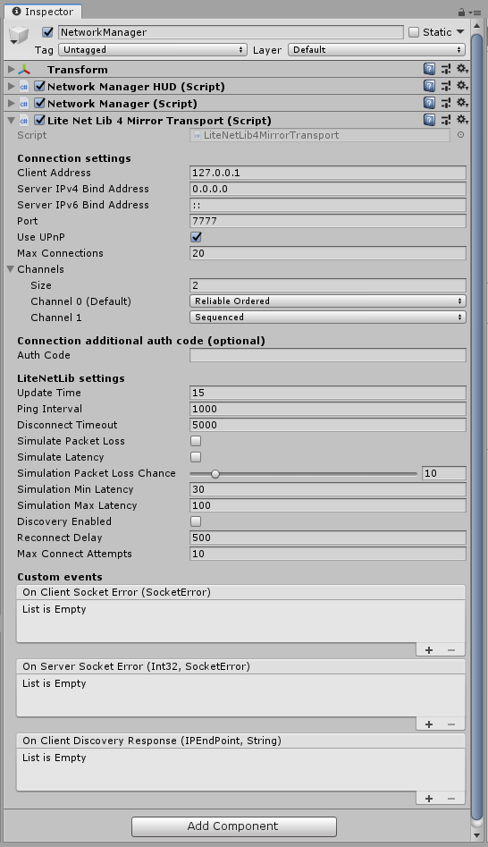

# LiteNetLib4Mirror Transport

**LiteNetLib based transport for Mirror.**

## Usage
1. Download the unity package from [Releases](https://github.com/MrGadget1024/LiteNetLib4Mirror/releases) and import it to your project (it does not contain Mirror)
2. Put LiteNetLib4MirrorTransport component on gameobject with NetworkManager and assign it there
3. (Optional) Make your NetworkManager derrive from LiteNetLib4MirrorNetworkManager and use optional overloads from it

## Features
- UDP
- Built-in Network Discovery and UPnP
- Fully managed code
- Small CPU and RAM usage
- Small packet size overhead ( 1 byte for unreliable, 3 bytes for reliable packets )
- Different send mechanics
- Reliable with order
- Reliable without order
- Ordered but unreliable with duplication prevention
- Simple UDP packets without order and reliability
- Automatic small packets merging
- Automatic fragmentation of reliable packets
- Automatic MTU detection
- NTP time requests
- Packet loss and latency simulation
- IPv6 support (dual mode)
- Connection statisitcs (need DEBUG or STATS_ENABLED flag)
- Multicasting (for discovering hosts in local network)

## IL2CPP Warning!
With IL2CPP, IPv6 is only supported on Unity 2018.3.6f1 and later because of this:  
[Unity ChangeLog](https://unity3d.com/unity/whats-new/2018.3.6)  
> IL2CPP: Added protocol support for IPv6 on Windows. (1099133)
>
> IL2CPP: Correctly indicate that IPv6 is not supported on non-IPv6 platforms. (1108823)

Also, socket Reuse Address option isn't available in IL2CPP.

## Credits
RevenantX - for [LiteNetLib](https://github.com/RevenantX/LiteNetLib/releases)  
vis2k & Paul - for [Mirror](https://assetstore.unity.com/packages/tools/network/mirror-129321)  
Coburn - for [Ignorance](https://github.com/SoftwareGuy/Ignorance) which i've used as an example  
Dankrushen - for helping me find one small mistake which i couldn't find for two days  
Lucas Ontivero - for [Open.Nat](https://github.com/lontivero/Open.NAT/releases), used for UPnP  
shiena - for NetworkDiscoveryHUD

