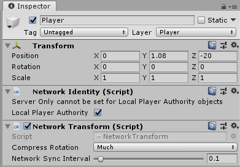

# NetworkTransform

The Network Transform component synchronizes the movement and rotation of game objects across the network. Note that the network Transform component only synchronizes networked game objects.

A game object with a Network Transform component must also have a Network Identity component. When you create a Network Transform component on a game object, Mirror also creates a Network Identity component on that game object if it does not already have one.

Network Transform interpolates on clients using `Vector3.MoveTowards`.

You can modify **Compress Rotation** to save some bandwidth when synchronizing the rotation. You can use the **Network Sync Interval** to specify how often it syncs (in seconds).

This component takes authority into account, so local player game objects (which have local authority) synchronize their position from the client to server, then out to other clients. Other game objects (with server authority) synchronize their position from the server to clients.

While this component and simple movement inputs is sufficient for fast prototyping and testing general game mechanics, it's not really intended for use as a fully functional character controller.  A proper character controller is recommended, either based on Unity's Character Controller, or a tick-based authoritative physics system.
