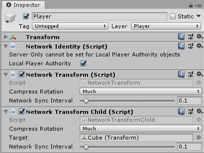

# NetworkTransformChild

The Network Transform Child component synchronizes the position and rotation of the child game object of a game object with a Network Transform component. You should use this component in situations where you need to synchronize an independently-moving child object of a Networked game object.

To use the Network Transform Child component, attach it to the same parent game object as the Network Transform, and use the Target field to define which child game object to apply the component settings to. You can have multiple Network Transform Child components on one parent game object .

You can modify **Compress Rotation** to save some bandwidth when synchronizing the rotation. You can use the **Network Sync Interval** to specify how often it syncs (in seconds).

This component takes authority into account, so local player game objects (which have local authority) synchronize their position from the client to server, then out to other clients. Other game objects (with server authority) synchronize their position from the server to clients.
