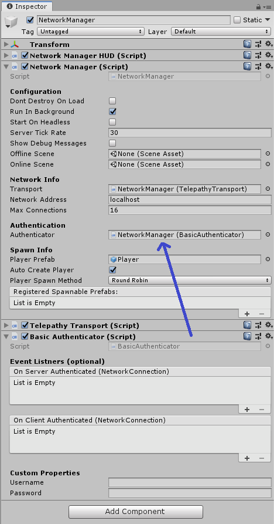

# Authentication

When you have a multiplayer game, often you need to store information about your player for later games, keep game stats or communicate with your friends. For all these use cases, you often need a way to uniquely identify a user. Being able to tell users apart is called authentication. There are several methods available, some examples include:

-   Ask the user for username and password

-   Use a third party oath or OpenID identity provider, such as Facebook, Twitter, Google

-   Use a third party service such as PlayFab, GameLift or Steam

-   Use the device id, very popular method in mobile

-   Use Google Play in Android

-   Use Game Center in IOS

-   Use a web service in your website

Mirror includes an Authenticator component framework that allows you to implement any authentication scheme you need.

## Encryption Warning

By default Mirror uses Telepathy, which is not encrypted, so if you want to do authentication through Mirror, we highly recommend you use a transport that supports encryption.

## Default Authenticator

Mirror automatically adds the Default Authenticator component to any object where the Network Manager component is present. Here's what that looks like:

```cs
namespace Mirror
{
    public class DefaultAuthenticator : Authenticator
    {
        public override void ServerAuthenticate(NetworkConnection conn)
        {
            conn.isAuthenticated = true;
            OnServerAuthenticated.Invoke(conn);
        }

        public override void ClientAuthenticate(NetworkConnection conn)
        {
            conn.isAuthenticated = true;
            OnClientAuthenticated.Invoke(conn);
        }
    }
}
```

## Custom Authenticators

Similar to the implementation of Transports in Mirror, the base Authenticator is an abstract class, so to make your own custom Authenticator, you can just create a new script in your project (not in the Mirror folders) that inherits from Authenticator and implements the minimal requirements:

-   You **must** implement **both** `ServerAuthenticate` and `ClientAuthenticate` as overrides, even if one of them might be empty, as in the Basic Authenticator example below.

-   When a client is authenticated to your satisfaction, you **must** set the `isAuthenticated` flag on the `NetworkConnection` to true on **both** the server and client 

-   When a client is authenticated to your satisfaction, you **must** invoke the `OnServerAuthenticated` and `OnClientAuthenticated` events on **both** the server and client

In addition to these requirements, we also *suggest* you do the following:

-   Send a message to the client if authentication fails, especially if there's some issue they can resolve.

-   Call the `Disconnect()` method of the `NetworkConnection` on the server and client when authentication fails.  If you want to give the user a few tries to get their credentials right, you certainly can, but Mirror will not do the disconnect for you.

    -   Remember to put a small delay on the Disconnect call on the server if you send them a failure message so that it has a chance to be delivered before the connection is dropped.

Now that you have foundation of a custom Authenticator component, the rest is up to you.  You can exchange any number of custom message between the server and client as necessary to complete your authentication process before approving the client.

## Basic Authentication

To get you started, here's a complete example of a custom Authenticator.

-   Create a new script in your project (not in the Mirror folders) called `BasicAuthenticator`

-   Replace the boilerplate code that Unity provides with the code below and save

-   Drag the script to the inspector of the object in your scene that has Network Manager

-   Assign the Basic Authenticator component to the Authenticator field in Network Manager

-   Remove the Default Authenticator component.

When you're done, it should look like this:



### Basic Authenticator

```cs
using UnityEngine;
using Mirror;

public class BasicAuthenticator : Authenticator
{
    // for demo purposes, set these in the inspector
    public string username;
    public string password;

    public class AuthRequestMessage : MessageBase
    {
        // use whatever credentials make sense for your game
        // for example, you might want to pass the accessToken if using oauth
        public string authUser;
        public string authPass;
    }

    public class AuthResponseMessage : MessageBase
    {
        public byte code;
        public string message;
    }

    public void Start()
    {
        NetworkServer.RegisterHandler<AuthRequestMessage>(OnAuthRequestMessage);
        NetworkClient.RegisterHandler<AuthResponseMessage>(OnAuthResponseMessage);
    }

    public override void ClientAuthenticate(NetworkConnection conn)
    {
        AuthRequestMessage authRequestMessage = new AuthRequestMessage
        {
            authUser = username,
            authPass = password
        };

        NetworkClient.Send(authRequestMessage);
    }

    public override void ServerAuthenticate(NetworkConnection conn)
    {
        // Do nothing...wait for AuthRequestMessage from client
    }

    public void OnAuthRequestMessage(NetworkConnection conn, AuthRequestMessage msg)
    {
        // check the credentials
        if (msg.authUser == username && msg.authPass == password)
        {
            // must set NetworkConnection isAuthenticated = true
            conn.isAuthenticated = true;

            // create and send msg to client so it knows to proceed
            AuthResponseMessage authResponseMessage = new AuthResponseMessage
            {
                code = 100,
                message = "Success"
            };

            NetworkServer.SendToClient(conn.connectionId, authResponseMessage);

            // must invoke server event when this connection is authenticated
            OnServerAuthenticated.Invoke(conn);
        }
        else
        {
            // must set NetworkConnection isAuthenticated = false
            conn.isAuthenticated = false;

            // create and send msg to client so it knows to disconnect
            AuthResponseMessage authResponseMessage = new AuthResponseMessage
            {
                code = 200,
                message = "Invalid Credentials"
            };

            NetworkServer.SendToClient(conn.connectionId, authResponseMessage);

            // disconnect the client after 1 second
            Invoke(nameof(conn.Disconnect), 1);
        }
    }

    public void OnAuthResponseMessage(NetworkConnection conn, AuthResponseMessage msg)
    {
        if (msg.code == 100)
        {
            Debug.LogFormat("Authentication Response: {0}", msg.message);

            // Set this on the client for local reference
            conn.isAuthenticated = true;

            // must invoke client event when this connection is authenticated
            OnClientAuthenticated.Invoke(conn);
        }
        else
        {
            Debug.LogErrorFormat("Authentication Response: {0}", msg.message);

            // Set this on the client for local reference
            conn.isAuthenticated = false;

            // disconnect the client
            conn.Disconnect();
        }
    }
}
```
