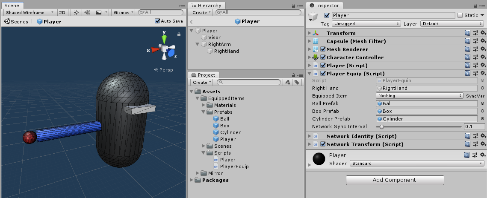

# Child Objects

Frequently the question comes up about how to handle objects that are attached as children of the player prefab that all clients need to know about and synchronize, such as which weapon is equipped, picking up networked scene objects, and players dropping objects into the scene.

>   Mirror cannot support multiple Network Identity components within an object hierarchy. Since the Player object must have a Network Identity, none of its descendant objects can have one.

## Simple Case

Let's start with the simple case of a single attachment point, called `RightHand`, that is somewhere down the hierarchy of our Player, likely at the end of an arm. In a script that inherits from NetworkBehaviour on the Player Prefab, we'd have a SyncVar enum with various choices of what the player is holding, and a `GameObject` reference where `RightHand` can be assigned in the inspector, and a Hook for the SyncVar to swap out the art of the held item based on the new value.

In the image below, I've created a simple player capsule with an arm and hand, and I've made some prefabs to be equipped (Ball, Box, Cylinder) and a Player Equip script to handle them.

**NOTE**: The item prefabs are *art only*...they have no scripts, and they *must not* have networking components. They can have monobehaviour-based scripts, of course, which can be referenced and called from ClientRpc's on the player prefab.



Below is the Player Equip script to handle the changing of the equipped item, and some notes for consideration:

-   While we could just have all the art items attached at design time and just enable / disable them based on the enum, this doesn't scale well to a lot of items and if they have scripts on them for how they behave in the game, such as animations, special effects, etc. it could get ugly pretty fast, so this example locally instantiates and destroys instead as a design choice.

-   The example makes no effort to deal with position offset between the item and the attach point, e.g. having the grip or handle of an item align with the hand.  This is best dealt with in a monobehaviour script on the item that has public fields for the local position and rotation that can be set in the designer and a bit of code in Start to apply those values in local coordinates relative to the parent attach point.

``` cs
using UnityEngine;
using Mirror;

public class PlayerEquip : NetworkBehaviour
{
    public enum EquippedItem : byte
    {
        nothing,
        ball,
        box,
        cylinder
    }

    public GameObject rightHand;

    [SyncVar(hook = nameof(OnChangeEquipment))]
    public EquippedItem equippedItem;

    public GameObject ballPrefab;
    public GameObject boxPrefab;
    public GameObject cylinderPrefab;

    void OnChangeEquipment(EquippedItem newEquippedItem)
    {
        while (rightHand.transform.childCount > 0)
            DestroyImmediate(rightHand.transform.GetChild(0).gameObject);

        switch (newEquippedItem)
        {
            case EquippedItem.ball:
                Instantiate(ballPrefab, rightHand.transform);
                break;
            case EquippedItem.box:
                Instantiate(boxPrefab, rightHand.transform);
                break;
            case EquippedItem.cylinder:
                Instantiate(cylinderPrefab, rightHand.transform);
                break;
        }
    }

    void Update()
    {
        if (!isLocalPlayer) return;

        if (Input.GetKeyDown(KeyCode.Alpha0) && equippedItem != EquippedItem.nothing)
            CmdChangeEquippedItem(EquippedItem.nothing);
        if (Input.GetKeyDown(KeyCode.Alpha1) && equippedItem != EquippedItem.ball)
            CmdChangeEquippedItem(EquippedItem.ball);
        if (Input.GetKeyDown(KeyCode.Alpha2) && equippedItem != EquippedItem.box)
            CmdChangeEquippedItem(EquippedItem.box);
        if (Input.GetKeyDown(KeyCode.Alpha3) && equippedItem != EquippedItem.cylinder)
            CmdChangeEquippedItem(EquippedItem.cylinder);
    }

    [Command]
    void CmdChangeEquippedItem(EquippedItem selectedItem)
    {
        equippedItem = selectedItem;
    }
}
```
