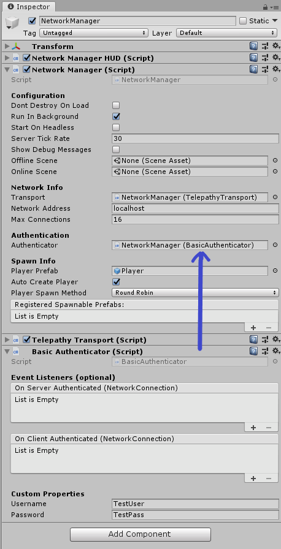

# Authentication

When you have a multiplayer game, often you need to store information about your player for later games, keep game stats or communicate with your friends. For all these use cases, you often need a way to uniquely identify a user. Being able to tell users apart is called authentication. There are several methods available, some examples include:
-   Ask the user for username and password
-   Use a third party oath or OpenID identity provider, such as Facebook, Twitter, Google
-   Use a third party service such as PlayFab, GameLift or Steam
-   Use the device id, very popular method in mobile
-   Use Google Play in Android
-   Use Game Center in IOS
-   Use a web service in your website

Mirror includes an  `Authenticator` abstract class that allows you to implement any authentication scheme you need.

## Encryption Warning

By default Mirror uses Telepathy, which is not encrypted, so if you want to do authentication through Mirror, we highly recommend you use a transport that supports encryption.

## Custom Authenticators

To make your own custom Authenticator, you can just create a new script in your project (not in the Mirror folders) that inherits from `Authenticator` and override the methods as needed.
-   When a client is authenticated to your satisfaction, you simply call `base.OnServerAuthenticated.Invoke(conn)` and `base.OnClientAuthenticated.Invoke(conn)` on the server and client, respectively.  Mirror is listening for these events to proceed with the connection sequence.
-   In the inspector you can optionally subscribe your own methods to the OnServerAuthenticated and OnClientAuthenticated events.

Here are some tips for custom Authenticators:
-   `OnStartServer` and `OnStartClient` are the appropriate methods to register server and client messages and their handlers.  They're called from StartServer/StartHost, and StartClient, respectively.
-   Send a message to the client if authentication fails, especially if there's some issue they can resolve.
-   Call the `Disconnect()` method of the `NetworkConnection` on the server and client when authentication fails. If you want to give the user a few tries to get their credentials right, you certainly can, but Mirror will not do the disconnect for you.

    -   Remember to put a small delay on the Disconnect call on the server if you send a failure message so that it has a chance to be delivered before the connection is dropped.
-   `NetworkConnection` has an `AuthenticationData` object where you can drop a class instance of any data you need to persist on the server related to the authentication, such as account id's, tokens, character selection, etc.

Now that you have the foundation of a custom Authenticator component, the rest is up to you. You can exchange any number of custom messages between the server and client as necessary to complete your authentication process before approving the client.

## Basic Authenticator

Mirror includes a Basic Authenticator in the Mirror / Authenticators folder which just uses a simple username and password.
-   Drag the Basic Authenticator script to the inspector of the object in your scene that has Network Manager
-   The Basic Authenticator component will automatically be assigned to the Authenticator field in Network Manager

When you're done, it should look like this:

>   **Note:** You don't need to assign anything to the event lists unless you want to subscribe to the events in your own code for your own purposes. Mirror has internal listeners for both events.

