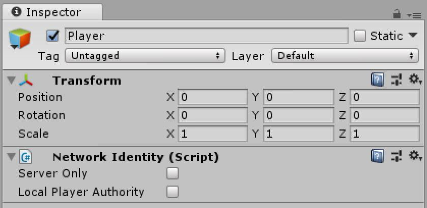
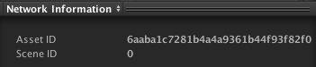
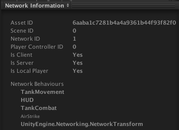

# NetworkIdentity

The Network Identity component is at the heart of the Unity networking high-level API. It controls a GameObject’s unique identity on the network, and it uses that identity to make the networking system aware of the GameObject. It offers two different options for configuration and they are mutually exclusive, which means either one of the options or none can be checked.

-   **Server Only**  
    Tick this checkbox to ensure that Unity only spawns the GameObject on the server, and not on clients.
-   **Local Player Authority**  
    Tick this checkbox to give authoritative network control of this GameObject to the client that owns it. The player GameObject on that client has authority over it. Other components such as Network Transform use this to determine which client to treat as the source of authority.

If none of these options is checked, the server will have authority over the object. Changes made by clients (e.g. moving the object) are not allowed and will not be synchronized.

## Instantiated Network GameObjects

With the Unity’s server-authoritative networking system, the server must spawn networked GameObjects with network identities, using [NetworkServer.Spawn]. This automatically creates them on clients that are connected to the server, and assigns them a [NetworkInstanceId].

You must put a Network Identity component on any Prefabs that spawn at runtime for the network system to use them. See [Object Spawning] for more information.

## Scene-based Network GameObjects

You can also network GameObjects that are saved as part of your Scene (for example, environmental props). Networking GameObjects makes them behave slightly differently, because you need to have them spawn across the network.

When building your game, Unity disables all Scene-based GameObjects with Network Identity components. When a client connects to the server, the server sends spawn messages to tell the client which Scene GameObjects to enable and what their most up-to-date state information is. This ensures the client’s game does not contain GameObjects at incorrect locations when they start playing, or that Unity does not spawn and immediately destroy GameObjects on connection (for example, if an event removed the GameObject before that client connected). See [Networked Scene GameObjects] for more information.

## Preview Pane Information

This component contains network tracking information, and displays that information in the preview pane. For example, the scene ID, network ID and asset ID the object has been assigned. This allows you to inspect the information which can be useful for investigation and debugging.

At runtime there is more information to display here (a disabled NetworkBehaviour is displayed non-bold):

-   **assetId**  
    This identifies the prefab associated with this object (for spawning).
-   **clientAuthorityOwner**  
    The client that has authority for this object. This will be null if no client has authority.
-   **connectionToClient**  
    The NetworkConnection associated with this NetworkIdentity. This is only valid for player objects on the server.
-   **connectionToServer**  
    The NetworkConnection associated with this NetworkIdentity. This is only valid for player objects on a local client.
-   **hasAuthority**  
    True if this object is the authoritative version of the object. This would mean either on a the server for normal objects, or on the client with localPlayerAuthority.
-   **isClient**  
    True if this object is running on a client.
-   **isLocalPlayer**  
    This returns true if this object is the one that represents the player on the local machine.
-   **isServer**  
    True if this object is running on the server, and has been spawned.
-   **localPlayerAuthority**  
    True if this object is controlled by the client that owns it - the local player object on that client has authority over it. This is used by other components such as NetworkTransform.
-   **netId**  
    A unique identifier for this network session, assigned when spawned.
-   **observers**  
    The list of client NetworkConnections that are able to see this object. This is read-only.
-   **playerControllerId**  
    The identifier of the controller associated with this object. Only valid for player objects.
-   **SceneId**  
    A unique identifier for networked objects in a Scene. This is only populated in play-mode.
-   **serverOnly**  
    A flag to make this object not be spawned on clients.
