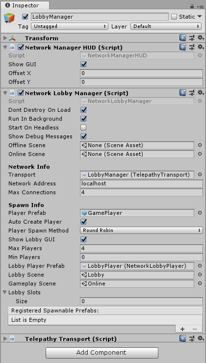

# NetworkLobbyManager

\*\*Please see the Lobby example in the Examples folder in your Mirror folder

The Network Lobby Manager is a specialized type of [Network Manager](NetworkManager) that provides a multiplayer lobby before entering the main play scene of the game. It allows you to set up a network with:

-   A maximum player limit

-   Automatic start when all players are ready

-   Option to prevent players from joining a game in progress

-   Customizable ways for players to choose options while in lobby  

There are two types of player objects with the Network Lobby Manager:

**Lobby Player Prefab**

-   One for each player

-   Created when client connects, or player is added

-   Persists until client disconnects

-   Holds ready flag and configuration data

-   Handles commands in the lobby

-   Must use the [Network Lobby Player](NetworkLobbyPlayer) component

**Player Prefab**

-   One for each player

-   Created when game scene is started

-   Destroyed when leaving game scene

-   Handles commands in the game  



## Properties

-   **Show Lobby GUI**  
    Show the default OnGUI controls for the lobby.

-   **Min Players**  
    Minimum number of players needed to start a game.

-   **Lobby Player Prefab**  
    The prefab to create for players when they enter the lobby (requires Network Lobby Player component).

-   **Lobby Scene**  
    The scene to use for the lobby.

-   **Gameplay Scene**  
    The scene to use for main game play.

-   **pendingPlayers**  
    List\<PendingPlayer\> that holds players that are ready to start playing.

-   **lobbySlots**  
    List\<NetworkLobbyPlayer\> that manages the slots for connected clients in the lobby.

-   **allPlayersReady**  
    Bool indicating if all players are ready to start playing.  This value changes as players invoke `CmdChangeReadyState` indicating true or false, and will be set false when a new client connects.

## Methods

### Server Virtual Methods

```cs
public virtual void OnLobbyStartHost() {}

public virtual void OnLobbyStopHost() {}

public virtual void OnLobbyStartServer() {}

public virtual void OnLobbyServerConnect(NetworkConnection conn) {}

public virtual void OnLobbyServerDisconnect(NetworkConnection conn) {}

public virtual void OnLobbyServerSceneChanged(string sceneName) {}

public virtual GameObject OnLobbyServerCreateLobbyPlayer(NetworkConnection conn)
{
    return null;
}

public virtual GameObject OnLobbyServerCreateGamePlayer(NetworkConnection conn)
{
    return null;
}

public virtual bool OnLobbyServerSceneLoadedForPlayer(GameObject lobbyPlayer, GameObject gamePlayer)
{
    return true;
}

public virtual void OnLobbyServerPlayersReady()
{
    ServerChangeScene(GameplayScene);
}
```

### Client Virtual Methods

```cs
public virtual void OnLobbyClientEnter() {}

public virtual void OnLobbyClientExit() {}

public virtual void OnLobbyClientConnect(NetworkConnection conn) {}

public virtual void OnLobbyClientDisconnect(NetworkConnection conn) {}

public virtual void OnLobbyStartClient() {}

public virtual void OnLobbyStopClient() {}

public virtual void OnLobbyClientSceneChanged(NetworkConnection conn) {}

public virtual void OnLobbyClientAddPlayerFailed() {}
```
