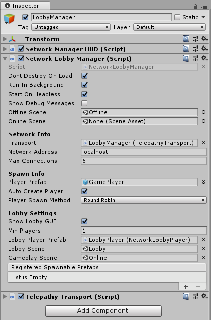

# Network Lobby Manager

**Please see the Lobby example in the Examples folder in your Mirror folder

The NetworkLobbyManager is a specialized type of [NetworkManager](NetworkManager) that provides a multiplayer lobby before entering the main play scene of the game. It allows you to set up a network with:

-   A maximum player limit
-   Automatic start when all players are ready
-   Option to prevent players from joining a game in progress
-   Customizable ways for players to choose options while in lobby
 

There are two types of player objects with the NetworkLobbyManager:

**Lobby Player Prefab**

-   One for each player
-   Created when client connects, or player is added
-   Persists until client disconnects
-   Holds ready flag and configuration data
-   Handles commands in the lobby
-   Must use the [NetworkLobbyPlayer](NetworkLobbyPlayer) component

**Player Prefab**

-   One for each player
-   Created when game scene is started
-   Destroyed when leaving game scene
-   Handles commands in the game
 

 

## Properties

-   **Show Lobby GUI**  
    Show the default OnGUI controls for the lobby.
-   **Min Players**  
    Minimum number of players needed to start a game.
-   **Lobby Player Prefab**  
    The prefab to create for players when they enter the lobby (requires NetworkLobbyPlayer component).
-   **Lobby Scene**  
    The scene to use for the lobby.
-   **Gameplay Scene**  
    The scene to use for main game play.
