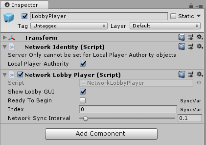

# NetworkLobbyPlayer

The Network Lobby Player stores per-player state for the [Network Lobby Manager](NetworkLobbyManager) while in the lobby. When using this component, you need to write a script which allows players to indicate they are ready to begin playing, which sets the ReadyToBegin property.

A game object with a Network Lobby Player component must also have a Network Identity component. When you create a Network Lobby Player component on a game object, Unity also creates a Network Identity component on that game object if it does not already have one.



-   **Show Lobby GUI**  
    Enable this to show the developer GUI for players in the lobby. This UI is only intended to be used for ease of development. This is enabled by default.

-   **Ready To Begin**  
    Enable this to have lobby players automatically be set to Ready.

-   **Index**  
    Sequential index of the player, e.g. Player 1, Player 2, etc.

-   **Network Sync Interval**  
    The rate at which information is sent from the Network Lobby Player to the server.

## Methods

### Client Virtual Methods

```cs
public virtual void OnClientEnterLobby() {}

public virtual void OnClientExitLobby() {}

public virtual void OnClientReady(bool readyState) {}
```
