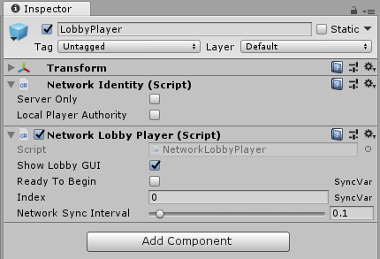

# NetworkLobbyPlayer

The Network Lobby Player stores per-player state for the [Network Lobby Manager](NetworkLobbyManager) while in the lobby. When using this component, you need to write a script which allows players to indicate they are ready to begin playing, which sets the ReadyToBegin property.

A GameObject with a Network Lobby Player component must also have a Network Identity component. When you create a Network Lobby Player component on a GameObject, Unity also creates a Network Identity component on that GameObject if it does not already have one.

-	**Show Lobby GUI**  
	Enable this to show the developer GUI for players in the lobby. This UI is only intended to be used for ease of development. This is enabled by default.
-	**Ready To Begin**  
	Enable this to have lobby players automatically be set to Ready.
-	**Network Sync Interval**  
	The rate at which information is sent from the Network Lobby Player to the server.