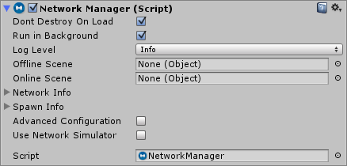
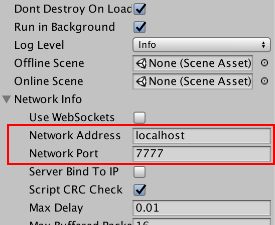
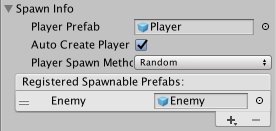
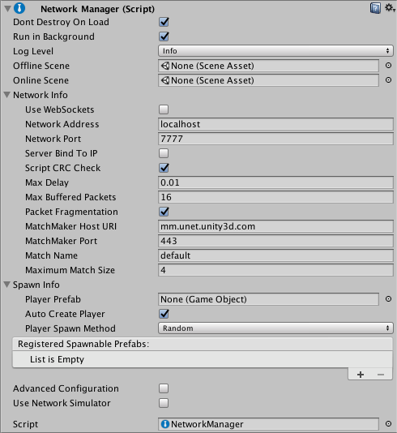

# NetworkManager

The Network Manager is a component for managing the networking aspects of a multiplayer game.

The Network Manager features include:

-   Game state management
-   Spawn management
-   Scene management
-   Debugging information
-   Customization

## Getting Started with the Network Manager

The Network Manager is the core controlling component of a multiplayer game. To get started, create an empty GameObject in your starting Scene, and add the NetworkManager component. The newly added Network Manager component looks like this:



The Inspector for the Network Manager in the Editor allows you to configure and control many things related to networking.

Note: You should only ever have one active Network Manager in each Scene. Do not place the Network Manager component on a networked GameObject (one which has a Network Identity component), because Mirror disables these when the Scene loads.

If you are already familiar with multiplayer game development, you might find it useful to know that the Network Manager component is implemented entirely using the API, so everything it does is also available to you through scripting. For advanced users, if you find that you need to expand on the Network Manager component’s features, you can use scripting to derive your own class from NetworkManager and customize its behaviour by overriding any of the virtual function hooks that it provides. However, the Network Manager component wraps up a lot of useful functionality into a single place, and makes creating, running and debugging multiplayer games as simple as possible.

## Game State Management

A Networking multiplayer game can run in three modes - as a client, as a dedicated server, or as a “Host” which is both a client and a server at the same time.

If you’re using the Network Manager HUD, it automatically tells the Network Manager which mode to start in, based on which options the player selects. If you’re writing your own UI that allows the player to start the game, you’ll need to call these from your own code. These methods are:

-   NetworkManager.StartClient
-   NetworkManager.StartServer
-   NetworkManager.StartHost



Whichever mode the game starts in (client, server, or host), the Network Address and Network Port properties are used. In client mode, the game attempts to connect to the address and port specified. In server or host mode, the game listens for incoming connections on the port specified.

## Spawn Management

Use the Network Manager to manage the spawning (networked instantiation) of networked GameObjects from Prefabs.



Most games have a Prefab which represents the player, so the Network Manager has a Player Prefab slot. You should assign this slot with your player Prefab. When you have a player Prefab set, a player GameObject is automatically spawned from that Prefab for each user in the game. This applies to the local player on a hosted server, and remote players on remote clients. You must attach a Network Identity component to the Player Prefab.

Once you have assigned a player Prefab, you can start the game as a host and see the player GameObject spawn. Stopping the game destroys the player GameObject. If you build and run another copy of the game and connect it as a client to *localhost*, the Network Manager makes another player GameObject appear. When you stop that client, it destroys that player’s GameObject.

In addition to the player Prefab, you must also register other Prefabs that you want to dynamically spawn during gameplay with the Network Manager.

You can add Prefabs to the list shown in the inspector labelled Registered Spawnable Prefabs. You can also can register prefabs via code, with the ClientScene.RegisterPrefab method.

If you have only one Network Manager, you need to register to it all prefabs which might be spawned in any Scene. If you have a separate Network Manager in each Scene, you only need to register the prefabs relevant for that Scene.

## Customizing Player Instantiation

The Network Manager spawns player GameObjects using its implementation of NetworkManager.OnServerAddPlayer. If you want to customize the way player GameObjects are created, you can override that virtual function. This code shows an example of the default implementation:

```cs
public virtual void OnServerAddPlayer(NetworkConnection conn, short playerControllerId)
{
    var player = (GameObject)GameObject.Instantiate(playerPrefab, playerSpawnPos, Quaternion.identity);
    NetworkServer.AddPlayerForConnection(conn, player, playerControllerId);
}
```

Note: If you are implementing a custom version of OnServerAddPlayer, the method NetworkServer.AddPlayerForConnection must be called for the newly created player GameObject, so that it is spawned and associated with the client’s connection. AddPlayerForConnection spawns the GameObject, so you do not need to use NetworkServer.Spawn.

## Start Positions

To control where players are spawned, you can use the Network Start Position component. To use these, attach a Network Start Position component to a GameObject in the Scene, and position the GameObject where you would like one of the players to start. You can add as many start positions to your Scene as you like. The Network Manager detects all start positions in your Scene, and when it spawns each player instance, it uses the position and orientation of one of them.

The Network Manager has a Player Spawn Method property, which allows you to configure how start positions are chosen.

-   Choose Random to spawn players at randomly chosen startPosition options.
-   Choose Round Robin to cycle through startPosition options in a set list.

If the Random or Round Robin modes don’t suit your game, you can customize how the start positions are selected by using code. You can access the available Network Start Position components by the list NetworkManager.startPositions, and you can use the helper method GetStartPosition on the Network Manager that can be used in implementation of OnServerAddPlayer to find a start position.

## Scene Management

Most games have more than one Scene. At the very least, there is usually a title screen or starting menu Scene in addition to the Scene where the game is actually played. The Network Manager is designed to automatically manage Scene state and Scene transitions in a way that works for a multiplayer game.

There are two slots on the NetworkManager Inspector for scenes: the Offline Scene and the Online Scene. Dragging Scene assets into these slots activates networked Scene management.

When a server or host is started, the Online Scene is loaded. This then becomes the current network Scene. Any clients that connect to that server are instructed to also load that Scene. The name of this Scene is stored in the networkSceneName property.

When the network is stopped, by stopping the server or host or by a client disconnecting, the offline Scene is loaded. This allows the game to automatically return to a menu Scene when disconnected from a multiplayer game.

You can also change Scenes while the game is active by calling NetworkManager.ServerChangeScene. This makes all the currently connected clients change Scene too, and updates networkSceneName so that new clients also load the new Scene.

While networked Scene management is active, any calls to game state management functions such NetworkManager.StartHost() or NetworkManager.StopClient() can cause Scene changes. This applies to the runtime control UI. By setting up Scenes and calling these methods, you can control the flow of your multiplayer game.

Note that Scene changes cause all the GameObjects in the previous Scene to be destroyed.

You should normally make sure the Network Manager persists between Scenes, otherwise the network connection is broken upon a Scene change. To do this, ensure the Don’t Destroy On Load box is checked in the Inspector. However it is also possible to have a separate Network Manager in each Scene with different settings, which may be helpful if you wish to control incremental Prefab loading, or different Scene transitions.

## Customization

There are virtual functions on the NetworkManager class that you can customize by creating your own derived class that inherits from NetworkManager. When implementing these functions, be sure to take care of the functionality that the default implementations provide. For example, in OnServerAddPlayer(), the function NetworkServer.AddPlayer must be called to activate the player GameObject for the connection.

These are all the callbacks that can happen for host/server and clients, in some cases it’s important to invoke the base class function to maintain default behaviour. To see the implementation itself you can view it in the source code.

```cs
using UnityEngine;
using Mirror;

public class CustomManager : NetworkManager {
    // Server callbacks
    public override void OnServerConnect(NetworkConnection conn)
    {
        Debug.Log("A client connected to the server: " + conn);
    }

    public override void OnServerDisconnect(NetworkConnection conn)
    {
        NetworkServer.DestroyPlayersForConnection(conn);

        if (conn.lastError != NetworkError.Ok)
        {
            if (LogFilter.logError)
                Debug.LogError("ServerDisconnected due to error: " + conn.lastError);
        }

        Debug.Log("A client disconnected from the server: " + conn);
    }

    public override void OnServerReady(NetworkConnection conn)
    {
        NetworkServer.SetClientReady(conn);

        Debug.Log("Client is set to the ready state (ready to receive state updates): " + conn);
    }

    public override void OnServerAddPlayer(NetworkConnection conn, short playerControllerId)
    {
        var player = (GameObject)GameObject.Instantiate(playerPrefab, Vector3.zero, Quaternion.identity);

        NetworkServer.AddPlayerForConnection(conn, player, playerControllerId);

        Debug.Log("Client has requested to get his player added to the game");
    }

    public override void OnServerRemovePlayer(NetworkConnection conn, PlayerController player)
    {
        if (player.gameObject != null)
            NetworkServer.Destroy(player.gameObject);
    }

    public override void OnServerError(NetworkConnection conn, int errorCode)
    {
        Debug.Log("Server network error occurred: " + (NetworkError)errorCode);
    }

    public override void OnStartHost()
    {
        Debug.Log("Host has started");
    }

    public override void OnStartServer()
    {
        Debug.Log("Server has started");
    }

    public override void OnStopServer()
    {
        Debug.Log("Server has stopped");
    }

    public override void OnStopHost()
    {
        Debug.Log("Host has stopped");
    }

    // Client callbacks
    public override void OnClientConnect(NetworkConnection conn)
    {
        base.OnClientConnect(conn);

        Debug.Log("Connected successfully to server, now to set up other stuff for the client...");
    }

    public override void OnClientDisconnect(NetworkConnection conn)
    {
        StopClient();

        if (conn.lastError != NetworkError.Ok)
        {
            if (LogFilter.logError)
                Debug.LogError("ClientDisconnected due to error: " + conn.lastError);
        }

        Debug.Log("Client disconnected from server: " + conn);
    }

    public override void OnClientError(NetworkConnection conn, int errorCode)
    {
        Debug.Log("Client network error occurred: " + (NetworkError)errorCode);
    }

    public override void OnClientNotReady(NetworkConnection conn)
    {
        Debug.Log("Server has set client to be not-ready (stop getting state updates)");
    }

    public override void OnStartClient(NetworkClient client)
    {
        Debug.Log("Client has started");
    }

    public override void OnStopClient() {
        Debug.Log("Client has stopped");
    }

    public override void OnClientSceneChanged(NetworkConnection conn)
    {
        base.OnClientSceneChanged(conn);

        Debug.Log("Server triggered scene change and we've done the same, do any extra work here for the client...");
    }
}
```

The inspector for the NetworkManager provides the ability to change some connection parameters and timeouts. Some parameters have not been exposed here but can be changed through code.

```cs
using UnityEngine;
using Mirror;

public class CustomManager : NetworkManager {

    // Set custom connection parameters early, so they are not too late to be enforced

    void Start()
    {
        customConfig = true;
        connectionConfig.MaxCombinedReliableMessageCount = 40;
        connectionConfig.MaxCombinedReliableMessageSize = 800;
        connectionConfig.MaxSentMessageQueueSize = 2048;
        connectionConfig.IsAcksLong = true;
        globalConfig.ThreadAwakeTimeout = 1;
    }
}
```

The Network Manager component allows you to control the state of a networked game. It provides an interface in the Editor for you to configure the network, the Prefabs you use for spawning GameObjects, and the Scenesyou use for different game states.

For more details on implementing the Network Manager in your game, see documentation on Using the Network Manager.



-   **Dont Destroy On Load**  
    Use this property to control whether or not Mirror should destroy the GameObject with the Network Manager when the Scene changes. Tick this checkbox to ensure Mirror does not destroy your Network Manager GameObject when the Scene changes in your game. Untick the checkbox if you want Mirror to destroy the GameObject when the Scene it exists in is no longer the active Scene. This is useful if you want to manage multiple, separate Network Manager GameObjects in each of your Scenes. This checkbox is ticked by default.
-   **Run In Background**  
    Use this property to control whether the networked game runs when the window it is running in is not focused. Tick the checkbox if you want it to run; untick it if you want the game to stop running when the window is not focused. This checkbox is ticked by default. You need to enable this property if you want to run multiple instances of a program on the same machine, such as when testing using localhost. You should disable it when deploying to mobile platforms. When enabled, it sets Application.runInBackground to true when the Network Manager starts up. You can also set this property from the Unity menu: Edit \> Project Settings, then select the Player category, and navigate to the Resolution and Presentation panel.
-   **Log Level**  
    Use this property to control the amount of information Mirror outputs to the console window. A low level results in more information; a high level results in less information. Each level includes message from all the levels higher than itself (for example, if you select “Warn”, the console also prints outputs all “Error” and “Fatal” log messages). The drop-down lists the levels from low to high. This property is set to Info by default. You can set Log Level to Set in Scripting to prevent the Network Manager from setting the log level at all. This means you can control the level from your own scripts instead.
-   **Offline Scene**  
    If you assign a Scene to this field, the Network Manager automatically switches to the specified Scene when a network session stops - for example, when the client disconnects, or when the server shuts down.
-   **Online Scene**  
    If you assign a Scene to this field, the Network Manager automatically switches to the specified Scene when a network session starts - for example, when the client connects to a server, or when the server starts listening for connections.
-   **Network Info**  
    You can expand this section of the inspector to access network-related settings, listed below
    -   **Use Web Sockets**  
        When running as a host, enable this setting to make the host listen for Web Socket connections instead of normal transport layer connections, so that WebGL clients can connect to it (if you build your game for the WebGL platform). These WebGL instances of your game cannot act as a host (in either peer-hosted or server-only mode). Therefore, for WebGL instances of your multiplayer game to be able to find each other and play together, you must host a server-only instance of your game running in LAN mode, with a publicly reachable IP address, and it must have this option enabled. This checkbox is unticked by default.
    -   **Network Address**  
        The network address currently in use. For clients, this is the address of the server that is connected to. For servers, this is the local address. This is set to ‘localhost’ by default.
    -   **Network Port**  
        The network port currently in use. For clients, this is the port of the server connected to. For servers, this is the listen port. This is set to 7777 by default.
    -   **Server Bind To IP**  
        Allows you to tell the server whether to bind to a specific IP address. If this checkbox is not ticked, then there is no specific IP address bound to (IP_ANY). This checkbox is unticked by default. Use this if your server has multiple network addresses (eg, internal LAN, external internet, VPN) and you want to specific the IP address to serve your game on.
    -   **Server Bind Address**  
        This field is only visible when the Server Bind To IP checkbox is ticked. Use this to enter the specific IP address that the server should bind to.
    -   **Script CRC Check**  
        When this is enabled, Mirror checks that the clients and the server are using matching scripts. This is useful to make sure outdated versions of your client are not connecting to the latest (updated) version of your server. This checkbox is ticked by default. It does this by performing a ([CRC check](https://en.wikipedia.org/wiki/Cyclic_redundancy_check)) between the server and client that ensures the NetworkBehaviour scripts match. This may not be appropriate in some cases, such as when you are intentionally using different Unity projects for the client and server. In most other cases however, you should leave it enabled.
    -   **Max Delay**  
        The maximum time in seconds to delay buffered messages. The default of 0.01 seconds means packets are delayed at most by 10 milliseconds. Setting this to zero disables connection buffering. This is set to 0.01 by default.
    -   **Max Buffered Packets**  
        The maximum number of packets that a NetworkConnection can buffer for each channel. This corresponds to the ChannelOption.MaxPendingBuffers channel option. This is set to 16 by default.
    -   **Packet Fragmentation**  
        This allows the `NetworkConnection` instances to fragment packets that are larger than `maxPacketSize` to up a maximum of 64K. This can cause delays in sending large packets. This checkbox is ticked by default.
-   **SpawnInfo**  
    You can expand this section of the inspector to access spawn-related settings, listed below
    -   **Player Prefab**  
        Define the default prefab Mirror should use to create player GameObjects on the server. Mirror creates Player GameObjects in the default handler for AddPlayer on the server. Implement OnServerAddPlayer to override this behavior.
    -   **Auto Create Player**  
        Tick this checkbox if you want Mirror to automatically create player GameObjects on connect, and when the Scene changes. This checkbox is ticked by default. Note that if you are using the MigrationManager and you do not enable Auto Create Player, you need to call ClientScene.SendReconnectMessage when your client reconnects.
    -   **Player Spawn Method**  
        Define how Mirror should decide where to spawn new player GameObjects. This is set to Random by default.
        -   **Random**  
            Choose Random to spawn players at randomly chosen startPositions.
        -   **Round Robin**  
            Choose Round Robin to cycle through startPositions in a set list.
    -   **Registered Spawnable Prefabs**  
        Use this list to add prefabs that you want the Network Manager to be aware of, so that it can spawn them. You can also add and remove them via scripting.
-   **Advanced Configuration**  
    Tick this checkbox to reveal advanced configuration options in the Network Manager Inspector window.
    -   **Max Connections**  
        Define the maximum number of concurrent network connections to support. This is set to 4 by default.
    -   **Qos Channels**  
        A list containing the different communication channels the current Network Manager has, and the Quality Of Service (QoS) setting for each channel. Use this list to add or remove channels, and adjust their QoS setting. You can also configure the channels via scripting. For the descriptions of each QoS option, see QosType.
-   **Timeouts**
    -   **Min Update Timeout**  
        Set the minimum time (in milliseconds) the network thread waits between sending network messages. The network thread doesn’t send multiplayer network messages immediately. Instead, it check each connection periodically at a fixed rate to see if it has something to send. This is set to 10ms by default. See API reference documentation on MinUpdateTimeout for more information.
    -   **Connect Timeout**  
        Define the amount of time (in milliseconds) Mirror should wait while trying to connect before attempting the connection again. This is set to 2000ms by default. See API reference documentation on ConnectTimeout for more information.
    -   **Disconnect Timeout**  
        The amount of time (in milliseconds) before Mirror considers a connection to be disconnected. This is set to 2000ms by default. See API reference documentation on DisconnectTimeout for more information.
    -   **Ping Timeout**  
        The amount of time (in milliseconds) between sending pings (also known as “keep-alive” packets). The ping timeout duration should be approximately one-third to one-quarter of the Disconnect Timeout duration, so that Mirror doesn’t assume that clients are disconnected until the server has failed to receive at least three pings from the client. This is set to 500ms by default. See API reference documentation on ConnectionConfig.PingTimeout for more information.
-   **Global Config**  
    These settings relate to the Reactor. The Reactor is the part of the multiplayer system which receives network packets from the underlying operating system, and passes them into the multiplayer system for processing.
    -   **Thread Awake Timeout**  
        The timeout duration in milliseconds, used by the Reactor. How the Reactor uses this value depends on which Reactor Model you select (see below). This is set to 1ms by default.
    -   **Reactor Model**  
        Choose which type of reactor to use. The reactor model defines how Mirror reads incoming packets. For most games and applications, the default Select reactor is appropriate. If you want to trade a small delay in the processing of network messages for lower CPU usage and improved battery life, use the Fix Rate reactor.
        -   **Select Reactor**  
            This model uses the `select()` API which means that the network thread “awakens” (becomes active) as soon as a packet is available. Using this method means your game gets the data as fast as possible. This is the default Reactor Model setting.
        -   **Fix Rate Reactor**  
            This model lets the network thread sleep manually for a given amount of time (defined by the value in Thread Awake Timeout) before checking whether there are incoming packets waiting to be processed.
    -   **Reactor Max Recv Messages**  
        Set the maximum number of messages stored in the receive queue. This is set to 1024 messages by default.
    -   **Reactor Max Sent Messages**  
        Set the maximum number of messages stored in the send queue. This is set to 1024 messages by default.
    -   **Use Network Simulator**  
        Tick this checkbox to enable the usage of the network simulator. The network simulator introduces simulated latency and packet loss based on the following settings:
        -   **Simulated Average Latency**  
            The amount of delay in milliseconds to simulate.
        -   **Simulated Packet Loss**  
            The amount of packet loss to simulate in percent.
