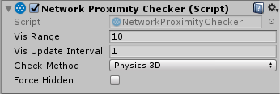

# NetworkProximityChecker

The Network Proximity Checker component controls the visibility of GameObjects for network clients, based on proximity to players.

-   **Vis Range**  
    Define the range that the GameObject should be visible in.
-   **Vis Update Interval**  
    Define how often (in seconds) the GameObject should check for players entering its visible range.
-   **Check Method**  
    Define which type of physics (2D or 3D) to use for proximity checking.
-   **Force Hidden**  
    Tick this checkbox to hide this object from all players.

With the Network Proximity Checker, a game running on a client doesn’t have information about GameObjects that are not visible. This has two main benefits: it reduces the amount of data sent across the network, and it makes your game more secure against hacking.

This component relies on physics to calculate visibility, so the GameObject must also have a collider component on it.

A GameObject with a Network Proximity Checker component must also have a [Network Identity] component. When you create a Network Proximity Checker component on a GameObject, Mirror also creates a Network Identity component on that GameObject if it does not already have one.
