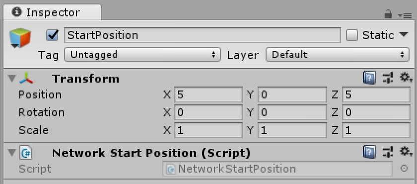

# NetworkStartPosition

NetworkStartPosition is used by the NetworkManager when creating player objects. The position and rotation of the NetworkStartPosition are used to place the newly created player object.

The NetworkManager will spawn players at (0, 0, 0) by default. Adding this component to a gameobject will automatically register/unregister its gameobjects transform at the NetworkManager as available spawning position.

It's possible to have multiple starting positions within one scene. Depending on the NetworkManager setting Spawn Info/Player Spawn Method the spawning is either Random (possible that the same spawn position will be used by two or more players) or Round Robin (use every available position, until there are more clients than spawn points).

