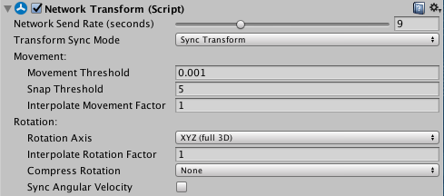

# NetworkTransform

The Network Transform component synchronizes the movement and rotation of GameObjects across the network. Note that the network Transform component only synchronizes spawned networked GameObjects.

You can modify **Compress Rotation** to save some bandwidth when synchronizing the rotation.
You can use the **Network Sync Interval** to specify how often it syncs (in seconds).

This component takes authority into account, so local player GameObjects (which have local authority) synchronize their position from the client to server, then out to other clients. Other GameObjects (with server authority) synchronize their position from the server to clients.

A GameObject with a Network Transform component must also have a Network Identity component. When you create a Network Transform component on a GameObject, Mirror also creates a Network Identity component on that GameObject if it does not already have one.
