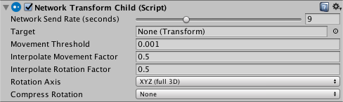

# NetworkTransformChild

The Network Transform Child component synchronizes the position and rotation of the child GameObject of a GameObject with a Network Transform component. You should use this component in situations where you need to synchronize an independently-moving child object of a Networked GameObject.

To use the Network Transform Child component, attach it to the same parent GameObject as the Network Transform, and use the Target field to define which child GameObject to apply the component settings to. You can have multiple Network Transform Child components on one parent GameObject.

-   **Network Send Rate (seconds)**  
    Set the number of network updates per second. You can set this slider to 0 for GameObjects that do not need to update after being created, like non-interactive effects generated by a player (for example, a dust cloud left behind that the player cannot interact with).
    -   Child transform to be synchronized. (Remember, this component goes on the *parent*, not the child - so you specify the child object using this field).
-   **Movement Threshold**  
    Set the distance that a GameObject can move without sending a movement synchronization update.
    -   Use this to enable and control **interpolation** of the synchronized movement. The larger this number is, the faster the GameObject interpolates to the **target position**. If this is set to 0, the GameObject snaps to the new position.
-   **Interpolate Rotation Factor**  
    Use this to enable and control interpolation of the synchronized rotation. The larger this number is, the faster the GameObject interpolates to the target rotation. If this is set to 0, the GameObject snaps to the new rotation.
    -   Define which rotation axis or axes should synchronize. This is set to XYZ (full 3D) by default.
-   **Compress Rotation**  
    If you compress rotation data, the amount of data sent is lower, and the accuracy of the rotation synchronization is lower.
    -   **None**  
        Choose this to apply no compression to the rotation synchronization. This is the default option.
    -   **Low**  
        Choose this to apply a low amount of compression to the rotation synchronization. This option lessens the amount of information sent for rotation data.
    -   **High**  
        Choose this to apply a high amount of compression to the rotation synchronization. This option sends the least amount of information possible for rotation data.

This component does not use physics; it synchronizes the position and rotation of the child GameObject, and interpolates towards updated values. Use Interpolate Movement Factor and Interpolate Rotation Factor to customize the rate of interpolation.

A GameObject with a Network Transform Child component must also have a Network Identity component. When you create a Network Transform Child component on a GameObject, Mirror also creates a Network Identity component on that GameObject if it does not already have one.
