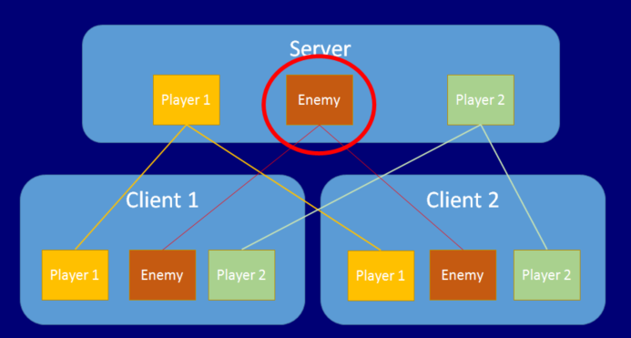

# Network Authority

Servers and clients can both manage a GameObject’s behavior. The concept of “authority” refers to how and where a GameObject is managed.

## Server Authority

The default state of authority in networked games using Mirror is that the Server has authority over all GameObjects which do not represent players. This means - for example - the server would manage control of all collectable items, moving platforms, NPCs - and any other parts of your game that players can interac and player GameObjects have authority on their owner’s client (meaning the client manages their behavior).

## Local Authority

Local authority (sometimes referred to as client authority) means the local client has authoritative control over a particular networked GameObject. This is in contrast to the default state which is that the server has authoritative control over networked GameObjects.

In addition to `isLocalPlayer`, you can choose to make the player GameObjects have “local authority”. This means that the player GameObject on its owner’s client is responsible for (or has authority over) itself. This is particularly useful for controlling movement; it means that each client has authority over how their own player GameObject is being controlled.

To enable local player authority on a GameObject, tick the Network Identity component’s Local Player Authority checkbox. The Network Transform component uses this “authority” setting, and sends movement information from the client to the other clients if this is set.

See Scripting API Reference documentation on NetworkIdentity and localPlayerAuthority for information on implementing local player authority via script.



Use the NetworkIdentity.hasAuthority property to find out whether a GameObject has local authority (also accessible on `NetworkBehaviour` for convenience). Non-player GameObjects have authority on the server, and player GameObjects with localPlayerAuthority set have authority on their owner’s client.

## Local (Client) Authority for Non-Player GameObjects

It is possible to have client authority over non-player GameObjects. There are two ways to do this. One is to spawn the GameObject using NetworkServer.SpawnWithClientAuthority, and pass the network connection of the client to take ownership. The other is to use NetworkIdentity.AssignClientAuthority with the network connection of the client to take ownership.

Assigning authority to a client causes Mirror to call OnStartAuthority() on each `NetworkBehaviour` on the GameObject, and sets the `hasAuthority` property to true. On other clients, the `hasAuthority` property remains false. Non-player GameObjects with client authority can send commands, just like players can. These commands are run on the server instance of the GameObject, not on the player associated with the connection.

If you want non-player GameObjects to have client authority, you must enable localPlayerAuthority on their Network Identity component. The example below spawns a GameObject and assigns authority to the client of the player that spawned it.

```
[Command]
void CmdSpawn()
{
    var go = (GameObject)Instantiate(otherPrefab, transform.position + new Vector3(0,1,0), Quaternion.identity);
    NetworkServer.SpawnWithClientAuthority(go, connectionToClient);
}
```


## Network Context Properties

The `NetworkBehaviour` class contains properties that allow scripts  
to know what the context of a networked GameObject is at any time.

-   isServer - true if the GameObject is on a server (or host) and has been spawned.
-   isClient - true if the GameObject is on a client, and was created by the server.
-   isLocalPlayer - true if the GameObject is a player GameObject for this client.
-   hasAuthority - true if the GameObject is owned by the local process

To see these properties, select the GameObject you want to inspect, and in the Inspector window, view the preview window for the NetworkBehaviour scripting components. You can use the value of these properties to execute code based on the context in which the script is running.
