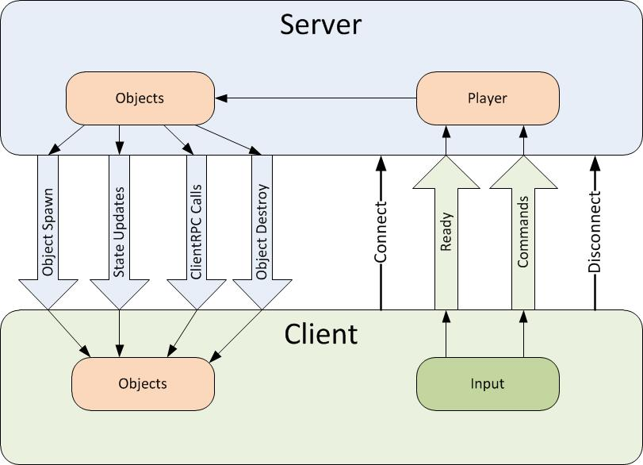

# Remote Actions

The network system has ways to perform actions across the network. These type of actions are sometimes called Remote Procedure Calls. There are two types of RPCs in the network system, Commands - which are called from the client and run on the server; and ClientRpc calls - which are called on the server and run on clients.

The diagram below shows the directions that remote actions take:



## Commands

Commands are sent from player objects on the client to player objects on the server. For security, Commands can only be sent from YOUR player object, so you cannot control the objects of other players. To make a function into a command, add the [Command] custom attribute to it, and add the “Cmd” prefix. This function will now be run on the server when it is called on the client. Any arguments will automatically be passed to the server with the command.

Commands functions must have the prefix “Cmd”. This is a hint when reading code that calls the command - this function is special and is not invoked locally like a normal function.

```
class Player : NetworkBehaviour
{
    public GameObject bulletPrefab;

    [Command]
    void CmdDoFire(float lifeTime)
    {
        GameObject bullet = (GameObject)Instantiate(
            bulletPrefab, 
            transform.position + transform.right,
            Quaternion.identity);
            
        var bullet2D = bullet.GetComponent<Rigidbody2D>();
        bullet2D.velocity = transform.right * bulletSpeed;
        Destroy(bullet, lifeTime);

        NetworkServer.Spawn(bullet);
    }

    void Update()
    {
        if (!isLocalPlayer)
            return;

        if (Input.GetKeyDown(KeyCode.Space))
            CmdDoFire(3.0f);
    }
}
```

Be careful of sending commands from the client every frame! This can cause a lot of network traffic.

By default, Commands are sent on channel zero - the default reliable channel. So by default all commands are reliably sent to the server. This can be customized with the “Channel” parameter of the [Command] custom attribute. This parameter should be an integer, representing the channel number.

Channel 1 is also set up by default to be an unreliable channel, so to use this, use the value 1 for the parameter in the Command attribute, like this:

```
    [Command(channel=1)]
```

Starting with Unity release 5.2 it is possible to send commands from non-player objects that have client authority. These objects must have been spawned with NetworkServer.SpawnWithClientAuthority or have authority set with NetworkIdentity.AssignClientAuthority. Commands sent from these object are run on the server instance of the object, not on the associated player object for the client.

## ClientRpc Calls

ClientRpc calls are sent from objects on the server to objects on clients. They can be sent from any server object with a NetworkIdentity that has been spawned. Since the server has authority, then there no security issues with server objects being able to send these calls. To make a function into a ClientRpc call, add the [ClientRpc] custom attribute to it, and add the “Rpc” prefix. This function will now be run on clients when it is called on the server. Any arguments will automatically be passed to the clients with the ClientRpc call..

ClientRpc functions must have the prefix “Rpc”. This is a hint when reading code that calls the method - this function is special and is not invoked locally like a normal function.

```
class Player : NetworkBehaviour
{

    [SyncVar]
    int health;

    [ClientRpc]
    void RpcDamage(int amount)
    {
        Debug.Log("Took damage:" + amount);
    }

    public void TakeDamage(int amount)
    {
        if (!isServer)
            return;

        health -= amount;
        RpcDamage(amount);
    }
}
```

When running a game as a host with a LocalClient, ClientRpc calls will be invoked on the LocalClient - even though it is in the same process as the server. So the behaviour of LocalClients and RemoteClients is the same for ClientRpc calls.

## Arguments to Remote Actions

The arguments passed to commands and ClientRpc calls are serialized and sent over the network. These arguments can be:

-   basic types (byte, int, float, string, UInt64, etc)
-   arrays of basic types
-   structs containing allowable types
-   built-in unity math types (Vector3, Quaternion, etc)
-   NetworkIdentity
-   NetworkInstanceId
-   NetworkHash128
-   GameObject with a NetworkIdentity component attached

Arguments to remote actions cannot be subcomponents of GameObjects, such as script instances or Transforms. They cannot be other types that cannot be serialized across the network.
