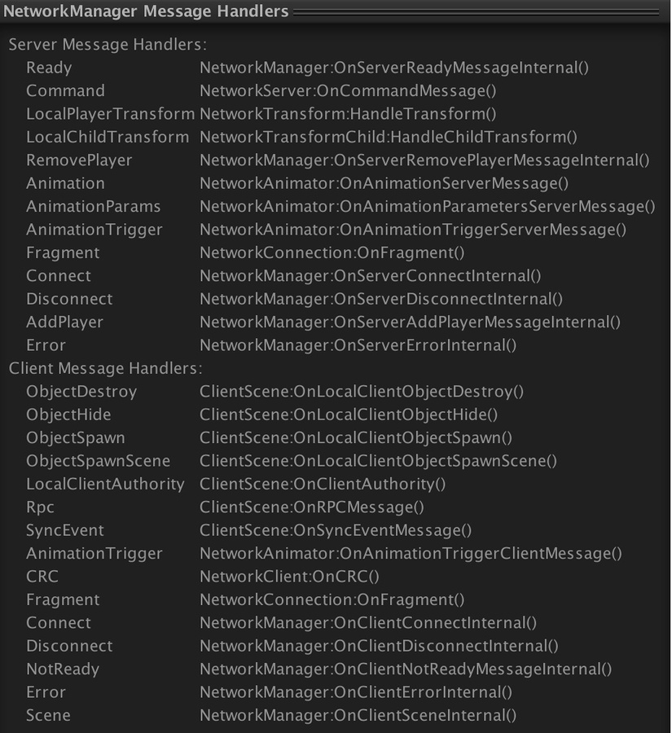

# Debugging Information

Mirror provides tools to get information about your game at run time. This information is useful for testing your multiplayer game.

When your game is running in the Editor in Play mode, the Network Manager shows additional information about the state of the network at runtime. This includes:

-   Network connections
-   Active GameObjects on the server which have a Network Identity component
-   Active GameObjects on the client which have a Network Identity component
-   Client peers

Additionally, the Network Manager preview pane (at the bottom of the Inspector window) lists the registered message callback handlers.

